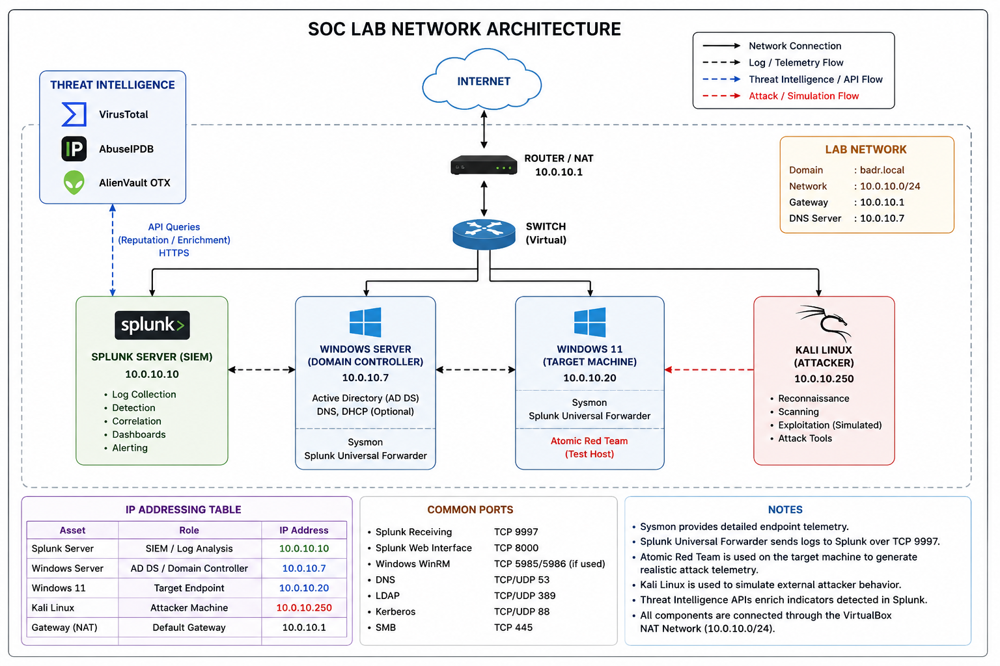

# SOC Lab Architecture

## 1. Architecture Overview

This project simulates a small enterprise Security Operations Center (SOC) environment designed to monitor endpoint activity, detect cyber threats, investigate security incidents, and document the complete detection and response lifecycle.

The laboratory consists of a centralized Splunk SIEM server, an Active Directory Domain Controller, a Windows 11 endpoint, and a Kali Linux attacker/simulation machine connected through a VirtualBox NAT Network.

Windows telemetry is collected using Sysmon and native Windows event logs, then forwarded to Splunk through the Splunk Universal Forwarder. Controlled attack scenarios are generated using Kali Linux and Atomic Red Team, while Threat Intelligence services enrich public IP indicators during investigations.

The architecture was intentionally designed as a lightweight SOC validation platform rather than a production deployment. Its objective is to reproduce the main technical workflows of a modern SOC inside an isolated virtual laboratory.

---

## 2. Design Objectives

The architecture was designed to achieve the following objectives:

- Simulate a realistic enterprise SOC environment.
- Centralize endpoint telemetry using Splunk SIEM.
- Collect detailed Windows telemetry using Sysmon.
- Forward endpoint logs using Splunk Universal Forwarder.
- Simulate controlled attack scenarios.
- Develop and validate detection rules.
- Map detection scenarios to MITRE ATT&CK techniques.
- Perform Threat Intelligence enrichment.
- Investigate security incidents.
- Apply the Five Whys technique for root cause analysis.
- Produce professional technical documentation.

---

## 3. Network Topology

The laboratory uses a dedicated VirtualBox NAT Network.

| Asset | Role | IP Address |
|---|---|---|
| Splunk Server | SIEM / Log Analytics | `10.0.10.10` |
| ADDC01 | Active Directory / Domain Controller | `10.0.10.7` |
| target-pc | Windows 11 Target Endpoint | `10.0.10.20` |
| Kali Linux | Security Simulation Machine | `10.0.10.250` |
| Gateway | VirtualBox NAT Gateway | `10.0.10.1` |

**Network:** `10.0.10.0/24`  
**Domain:** `badr.local`  
**DNS Server:** `10.0.10.7`



---

## 4. Design Decisions

### 4.1 Splunk SIEM

#### Purpose

Centralized Security Information and Event Management (SIEM).

#### Why was it selected?

Splunk provides log collection, indexing, SPL-based searches, dashboards, alerting, and investigation capabilities suitable for SOC monitoring and detection engineering.

#### Role

Splunk is responsible for:

- Receiving telemetry from monitored Windows systems.
- Indexing security events.
- Executing SPL detection searches.
- Correlating events during investigations.
- Supporting dashboards and monitoring views.
- Integrating Threat Intelligence enrichment data.
- Supporting incident investigation.

#### Main Indexes

The following indexes are used in the laboratory:

| Index | Purpose |
|---|---|
| `windows` | General Windows telemetry |
| `sysmon` | Sysmon endpoint telemetry |
| `activedirectory` | Active Directory-related telemetry |
| `threat_intel` | Threat Intelligence enrichment data |
| `atomic` | Atomic Red Team-related activity |

#### Expected Output

Centralized visibility across monitored systems and a single investigation point for SOC analysis.

---

### 4.2 Windows Server – Active Directory Domain Controller

**Hostname:** `ADDC01`  
**IP Address:** `10.0.10.7`  
**Domain:** `badr.local`

#### Purpose

Provide an Active Directory environment representing centralized enterprise identity and authentication services.

#### Role

The Domain Controller is used to:

- Operate the `badr.local` Active Directory domain.
- Provide DNS services to laboratory systems.
- Generate Windows and Active Directory telemetry.
- Provide a monitored Windows Server system.
- Participate in authentication and RDP-related validation scenarios.

#### Security Monitoring

The server contains:

- Sysmon
- Splunk Universal Forwarder
- Native Windows event logging

Relevant telemetry is forwarded to the centralized Splunk server.

#### Expected Output

Visibility into server-side activity, authentication activity, endpoint behavior, and RDP-related telemetry.

---

### 4.3 Windows 11 Endpoint

**Hostname:** `target-pc`  
**IP Address:** `10.0.10.20`

#### Purpose

Represent a monitored enterprise workstation and the primary endpoint used for controlled detection validation.

#### Role

The Windows 11 endpoint is used to:

- Generate normal Windows activity.
- Execute controlled Atomic Red Team tests.
- Generate process telemetry.
- Generate registry telemetry.
- Generate network-related telemetry.
- Validate Splunk detection searches.
- Support SOC investigations.

#### Monitoring Components

The endpoint contains:

- Sysmon
- Splunk Universal Forwarder
- Native Windows event channels
- Atomic Red Team

#### Expected Output

Detailed endpoint telemetry forwarded to Splunk for detection, correlation, and investigation.

---

### 4.4 Sysmon

#### Purpose

Provide detailed Windows endpoint telemetry beyond standard Windows logging.

#### Why was it selected?

Sysmon provides visibility into security-relevant endpoint activity such as process creation, network connections, registry changes, file creation, module loading, and DNS queries.

The laboratory uses a Sysmon configuration based on the SwiftOnSecurity configuration.

#### Relevant Event IDs

The following Sysmon Event IDs were validated in the laboratory:

| Event ID | Description |
|---:|---|
| `1` | Process Creation |
| `3` | Network Connection |
| `7` | Image Loaded |
| `11` | File Creation |
| `13` | Registry Value Set |
| `22` | DNS Query |

Not every event type is expected to appear during every simulation.

Detection logic is based on telemetry actually observed during each validation scenario rather than assuming that an expected event was generated.

#### Expected Output

Detailed endpoint visibility supporting behavioral detection and SOC investigation.

---

### 4.5 Splunk Universal Forwarder

#### Purpose

Forward Windows telemetry from monitored systems to the centralized Splunk server.

#### Installed On

- `ADDC01`
- `target-pc`

#### Data Flow

```text
Windows Event Logs / Sysmon
          |
          v
Splunk Universal Forwarder
          |
          | TCP 9997
          v
Splunk Server
10.0.10.10
```

The Splunk server receives forwarded events through:

```text
[splunktcp://9997]
```

The current laboratory therefore uses standard Splunk TCP forwarding on port `9997`.

TLS is **not enabled** on the forwarding channel in the current implementation.

#### Expected Output

Centralized forwarding of selected Windows event channels to Splunk.

---

### 4.6 Kali Linux

**IP Address:** `10.0.10.250`

#### Purpose

Provide an isolated security simulation machine inside the laboratory.

#### Role

Kali Linux is used to:

- Generate controlled network activity.
- Support security validation scenarios.
- Represent an attacker/simulation system inside the isolated network.
- Support selected communication and transfer scenarios.
- Provide a destination system during the HTTP data transfer validation.

Kali Linux is used exclusively inside the controlled virtual laboratory.

#### Expected Output

Reproducible activity that can be correlated with endpoint and Splunk telemetry.

---

### 4.7 Atomic Red Team

#### Purpose

Generate controlled endpoint activity mapped to MITRE ATT&CK techniques.

#### Why was it selected?

Atomic Red Team provides small and repeatable security tests that allow detection logic and endpoint telemetry to be validated against specific behaviors.

#### Role

Atomic Red Team is used primarily on the Windows 11 endpoint to generate controlled activity associated with the project detection use cases.

Examples include:

- PowerShell execution.
- Encoded PowerShell activity.
- Obfuscated PowerShell activity.
- System information discovery.
- Registry-based persistence.
- Credential-access-related simulation.
- Collection activity.

The resulting telemetry is collected by Sysmon, forwarded to Splunk, and analyzed using SPL detection searches.

#### Expected Output

Repeatable telemetry for detection engineering and SOC investigation validation.

---

### 4.8 Threat Intelligence

#### Purpose

Enrich public IP indicators observed during SOC investigations.

#### Integrated Sources

The following Threat Intelligence services are integrated:

- VirusTotal
- AbuseIPDB
- AlienVault OTX

#### Architecture

```text
                 +----------------+
                 |     Splunk     |
                 +-------+--------+
                         |
                         | Public IP Indicators
                         v
              +-----------------------+
              | Threat Intel Scripts  |
              +-----------+-----------+
                          |
            +-------------+-------------+
            |             |             |
            v             v             v
      VirusTotal      AbuseIPDB     AlienVault OTX
            |             |             |
            +-------------+-------------+
                          |
                          v
                Unified Enrichment
                          |
                          v
                 threat_intel.csv
                          |
                          v
                   Splunk Lookup
                          |
                          v
                  SOC Investigation
```

#### Threat Intelligence Scripts

```text
scripts/threat-intel/
├── virustotal_lookup.py
├── abuseipdb_lookup.py
├── otx_lookup.py
├── enrich_ip.py
└── auto_enrich.py
```

Individual lookup scripts communicate with their corresponding Threat Intelligence providers.

`enrich_ip.py` combines the available reputation information into a unified enrichment result.

`auto_enrich.py` automates the enrichment workflow and updates the `threat_intel.csv` lookup used by Splunk.

API credentials are stored outside the GitHub repository.

#### Automated Workflow

The implemented workflow follows this sequence:

```text
Splunk
   |
   | Export Public IPs
   v
Python Automation
   |
   v
Threat Intelligence APIs
   |
   v
Unified Reputation Data
   |
   v
threat_intel.csv
   |
   v
Splunk Lookup
   |
   v
Dashboard / Investigation
```

#### Expected Output

Additional reputation and contextual information for public IP addresses observed during investigations.

---

## 5. Security Data Flow

The security monitoring pipeline follows this architecture:

```text
+-----------------------------+
| Windows Server / Windows 11 |
+-------------+---------------+
              |
              | Windows Logs / Sysmon
              v
+-----------------------------+
| Splunk Universal Forwarder  |
+-------------+---------------+
              |
              | TCP 9997
              v
+-----------------------------+
|        Splunk SIEM          |
|  Indexing / Search / SPL    |
+-------------+---------------+
              |
              v
+-----------------------------+
| Detection & Correlation     |
+-------------+---------------+
              |
              v
+-----------------------------+
| SOC Investigation           |
+-------------+---------------+
              |
        +-----+-----+
        |           |
        v           v
+---------------+  +------------------+
| Threat Intel  |  | MITRE ATT&CK     |
| Enrichment    |  | Mapping          |
+-------+-------+  +------------------+
        |
        v
+-----------------------------+
| Incident Analysis / Report  |
+-----------------------------+
```

### Detection Workflow

The general detection workflow is:

1. Security activity occurs on a monitored system.
2. Windows or Sysmon records the activity.
3. Splunk Universal Forwarder collects the selected event.
4. The event is forwarded to `10.0.10.10` over TCP port `9997`.
5. Splunk indexes the event.
6. SPL searches identify relevant suspicious behavior.
7. The analyst reviews related telemetry.
8. Relevant indicators may be enriched using Threat Intelligence.
9. The activity is mapped to MITRE ATT&CK when applicable.
10. Investigation findings are documented.
11. The corresponding incident report is produced.

This workflow represents the core SOC lifecycle implemented in the laboratory.

---

## 6. Network Ports

The following ports are relevant to the laboratory architecture:

| Port | Protocol | Service / Purpose |
|---:|---|---|
| `9997` | TCP | Splunk Universal Forwarder → Splunk Receiver |
| `8000` | TCP | Splunk Web Interface |
| `53` | TCP/UDP | DNS |
| `88` | TCP/UDP | Kerberos |
| `389` | TCP/UDP | LDAP |
| `445` | TCP | SMB |
| `3389` | TCP | Remote Desktop Protocol |
| `5985/5986` | TCP | Windows Remote Management when applicable |

Additional temporary application ports may be used during controlled validation scenarios.

The listed ports describe the laboratory environment and should not be interpreted as a recommended production firewall policy.

---

## 7. Detection Use Cases

Nine detection scenarios were validated during the project.

| ID | Detection Use Case |
|---|---|
| `UC-001` | Suspicious PowerShell |
| `UC-002` | Encoded PowerShell |
| `UC-003` | System Information Discovery |
| `UC-004` | Registry Run Key Persistence |
| `UC-005` | LSASS Credential Dumping |
| `UC-006` | Obfuscated PowerShell |
| `UC-007` | RDP Lateral Movement |
| `UC-008` | Archive Collected Data |
| `UC-009` | HTTP Data Exfiltration |

Each use case documents:

- The security objective.
- The simulated behavior.
- Relevant telemetry.
- Detection logic.
- SPL searches.
- MITRE ATT&CK mapping.
- Investigation evidence.
- Root cause analysis when applicable.
- Validation results.

### UC-007 – RDP Lateral Movement

During the RDP validation scenario, Windows Security Event IDs `4624` and `4625` were not usable in Splunk for the validated activity.

The investigation therefore relied on RDP-specific telemetry that was actually available:

- Event ID `131` from `Microsoft-Windows-RemoteDesktopServices-RdpCoreTS/Operational`
- Event ID `1149` from `Microsoft-Windows-TerminalServices-RemoteConnectionManager/Operational`

The validated scenario involved:

```text
Source:
ADDC01
10.0.10.7

Destination:
target-pc
10.0.10.20

Account:
BADR\Administrator
```

This correlation provided evidence of the RDP activity despite the absence of usable `4624/4625` telemetry for the scenario.

### UC-009 – HTTP Data Exfiltration

The final data transfer scenario involved transferring:

```text
collection.zip
```

from the Windows environment to the Kali Linux system:

```text
10.0.10.250:8000
```

Sysmon Event ID `3` was expected during the validation but was not observed.

The detection therefore relied on the available Sysmon Event ID `1` process telemetry associated with the transfer command.

The project intentionally documents this limitation rather than claiming telemetry that was not observed.

This demonstrates an important detection engineering principle:

> Detection logic must be based on telemetry actually available in the monitored environment.

---

## 8. SOC Dashboard

A Splunk dashboard was implemented to provide centralized visibility into the laboratory.

The dashboard contains the following panels:

1. Security Events Over Time
2. Events by Host
3. Sysmon Event Distribution
4. Authentication Activity
5. RDP Activity
6. Top External Destination IPs
7. Threat Intelligence Overview
8. PowerShell Activity
9. Detection Alerts Activity
10. Network Connections by Process

### Dashboard Purpose

The dashboard provides a high-level operational view for:

- Security monitoring.
- Initial triage.
- Endpoint visibility.
- Authentication monitoring.
- RDP monitoring.
- PowerShell monitoring.
- External network activity.
- Threat Intelligence context.
- Detection alert tracking.

The dashboard supports investigations but does not replace detailed SPL analysis.

---

## 9. Incident Documentation

Each validated detection scenario is associated with an incident investigation report.

```text
IR-001
IR-002
IR-003
IR-004
IR-005
IR-006
IR-007
IR-008
IR-009
```

Incident reports document the evidence observed during validation and the corresponding SOC analysis.

Where appropriate, the Five Whys methodology is used to support root cause analysis.

The overall incident handling workflow follows the PICERL lifecycle:

```text
Preparation
     |
     v
Identification
     |
     v
Containment
     |
     v
Eradication
     |
     v
Recovery
     |
     v
Lessons Learned
```

---

## 10. Design Limitations

The architecture contains several intentional limitations because it is a validation laboratory rather than a production SOC deployment.

### 10.1 Virtualized Environment

The entire environment runs on virtual machines.

The laboratory does not reproduce the scale, redundancy, high availability, or operational constraints of a production enterprise infrastructure.

---

### 10.2 Splunk Free License

The environment uses Splunk Free.

The license provides approximately:

```text
500 MB/day
```

of daily indexing capacity.

This is sufficient for the current laboratory but limits scalability.

---

### 10.3 Limited Number of Endpoints

The laboratory contains only a small number of monitored systems.

A production SOC would typically ingest telemetry from significantly more:

- Workstations
- Servers
- Network devices
- Security appliances
- Applications
- Cloud services

---

### 10.4 Forwarding Security

Splunk Universal Forwarder currently communicates with the Splunk receiver through:

```text
TCP 9997
```

using:

```text
[splunktcp://9997]
```

TLS is not enabled on this forwarding channel.

This configuration is acceptable for the isolated validation laboratory but should not be considered the preferred architecture for a production deployment.

---

### 10.5 Threat Intelligence Dependency

Threat Intelligence enrichment depends on external APIs.

Results can be affected by:

- API availability
- API rate limits
- Internet connectivity
- Provider-specific reputation data
- Differences between intelligence providers

Threat Intelligence is therefore used as investigation context rather than as the sole basis for a security decision.

---

### 10.6 Telemetry Availability

Not every expected Windows or Sysmon event was available during every validation scenario.

Examples include:

- Windows Security `4624/4625` not being usable for the validated UC-007 RDP scenario.
- Sysmon Event ID `3` not being observed during the validated UC-009 transfer scenario.

The detection strategy therefore relies on telemetry actually observed in Splunk.

---

### 10.7 Single Splunk Server

The current architecture uses one Splunk server for the main SIEM functions.

This design is appropriate for the laboratory but does not provide the distributed architecture, redundancy, or high availability expected from a large production environment.

---

## 11. Future Improvements

The current architecture can be extended in several directions.

### 11.1 Secure Log Forwarding

Enable TLS between Splunk Universal Forwarders and the Splunk receiver.

---

### 11.2 Additional Endpoints

Add additional Windows and Linux endpoints to increase telemetry diversity and improve correlation scenarios.

---

### 11.3 Network Telemetry

Integrate dedicated network monitoring sources to complement endpoint telemetry.

---

### 11.4 Extended Detection Coverage

Develop additional detection rules covering more MITRE ATT&CK techniques and behavioral patterns.

---

### 11.5 Threat Intelligence Automation

Extend the current enrichment workflow with:

- Additional intelligence providers.
- Indicator expiration.
- Confidence scoring.
- Improved reputation classification.
- Historical enrichment tracking.

---

### 11.6 Alert Management

Improve:

- Alert prioritization.
- Severity classification.
- Analyst triage.
- Detection tuning.
- False-positive management.

---

### 11.7 SOAR Integration

Introduce Security Orchestration, Automation and Response capabilities to automate repetitive investigation and response workflows.

---

### 11.8 Detection Testing

Expand automated detection validation so that SPL searches can be tested after configuration or detection changes.

---

### 11.9 Scalability

For a larger deployment, separate ingestion, search, storage, and management components instead of relying on the current single-server Splunk architecture.

---

## 12. Architecture Summary

The final architecture combines:

- **Splunk** for centralized SIEM capabilities.
- **Sysmon** for detailed Windows endpoint telemetry.
- **Splunk Universal Forwarder** for centralized log forwarding.
- **Windows Server Active Directory** for enterprise identity simulation.
- **Windows 11** as the primary monitored endpoint.
- **Kali Linux** for controlled security simulations.
- **Atomic Red Team** for repeatable detection validation.
- **MITRE ATT&CK** for behavioral mapping.
- **VirusTotal** for Threat Intelligence enrichment.
- **AbuseIPDB** for IP reputation enrichment.
- **AlienVault OTX** for Threat Intelligence context.
- **Python automation** for indicator enrichment.
- **Splunk dashboards** for SOC monitoring.
- **SPL searches** for detection and investigation.
- **Incident reports** for documenting validated scenarios.

The result is a compact SOC validation platform capable of demonstrating the complete workflow from:

```text
Telemetry Collection
        |
        v
Centralized Logging
        |
        v
Detection
        |
        v
Correlation
        |
        v
Threat Intelligence Enrichment
        |
        v
Investigation
        |
        v
Incident Documentation
```

This architecture provides a practical environment for developing and validating SOC analyst workflows while documenting the technical limitations and observations encountered during implementation.``
