# UC-000 — Environment Setup

## Objective

Prepare the Enterprise SOC Lab by configuring the Splunk SIEM infrastructure and validating endpoint telemetry using Sysmon before integrating Windows endpoints into the monitoring platform.

---

# 1. Splunk Base Configuration

## 1.1 Dedicated Indexes

Five dedicated indexes were created to organize security data based on its source and purpose.

| Index | Purpose |
|--------|---------|
| windows | Windows Event Logs |
| sysmon | Sysmon telemetry |
| activedirectory | Active Directory events |
| threat_intel | Threat Intelligence data |
| atomic | Atomic Red Team events |

Using dedicated indexes improves data organization, search performance, and simplifies detection engineering.

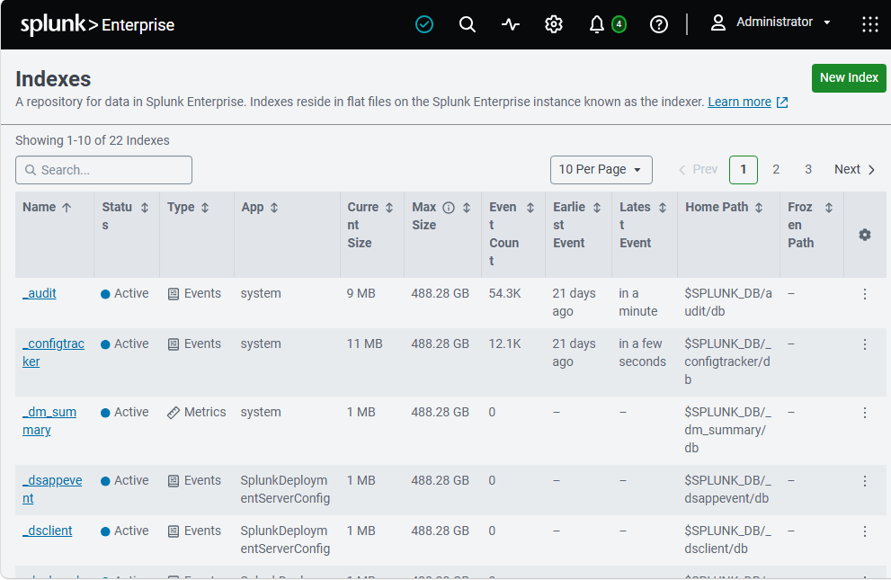

---

## 1.2 Receiving Port

Splunk was configured to listen on TCP port **9997**.

This port is used by the Splunk Universal Forwarder to securely transmit logs from monitored endpoints.

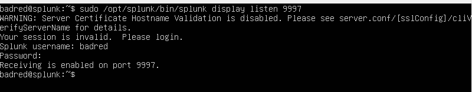

---

## 1.3 Windows Sourcetypes Verification

The default Windows sourcetypes were verified to ensure that Splunk correctly parses Windows Event Logs and Sysmon telemetry.

Verified sourcetypes include:

- WinEventLog:Security
- WinEventLog:System
- WinEventLog:Application
- XmlWinEventLog

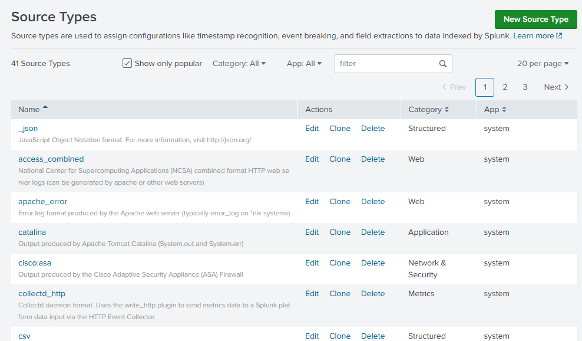

---

## 1.4 Time Synchronization

The Splunk server, Windows Server, Windows 11 workstation, and Kali Linux attacker machine were configured to use the **Africa/Casablanca** timezone.

Time synchronization is essential for accurate event correlation during security investigations.

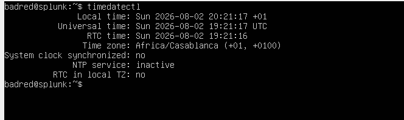

---

## 1.5 Splunk Health Validation

The Splunk service was verified to ensure that the platform is operational.

License information:

- Splunk Enterprise Trial
- Daily ingestion limit: **500 MB**
- License status: Active

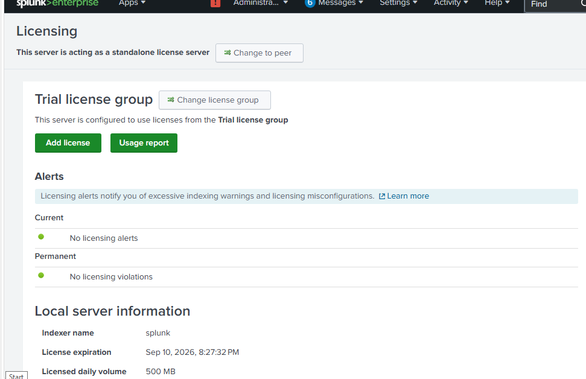

---

# 2. Sysmon Validation

## 2.1 Service Status

The Sysmon service was verified to ensure that endpoint telemetry collection is active.

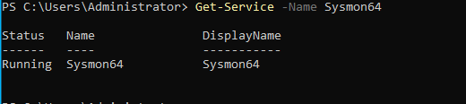

---

## 2.2 Configuration Validation

The SwiftOnSecurity configuration was successfully applied.

This configuration enables detailed endpoint telemetry while reducing unnecessary events.

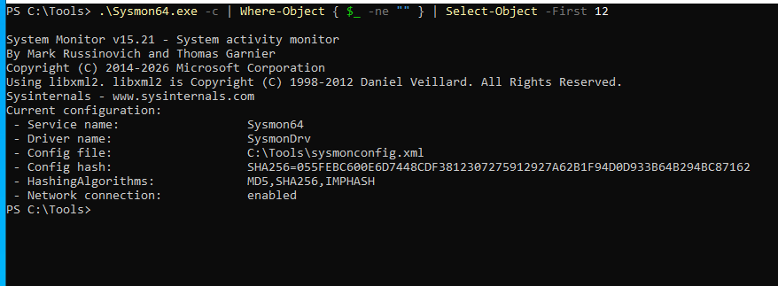

---

## 2.3 Operational Log

Sysmon events were successfully generated inside:

```
Microsoft-Windows-Sysmon/Operational
```

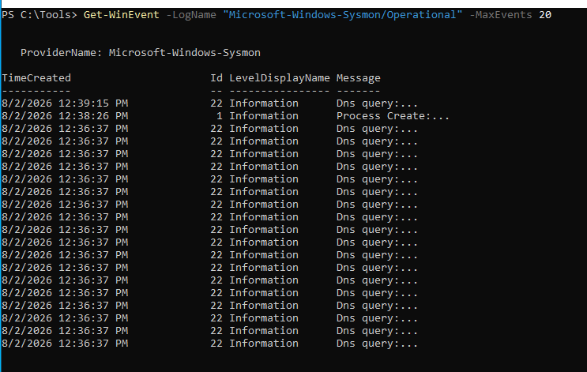

---

## 2.4 Verified Event IDs

The following Event IDs were successfully generated and verified.

| Event ID | Description |
|----------|-------------|
| 1 | Process Creation |
| 3 | Network Connection |
| 7 | Image Loaded |
| 11 | File Creation |
| 13 | Registry Modification |
| 22 | DNS Query |

---

### Event ID 1

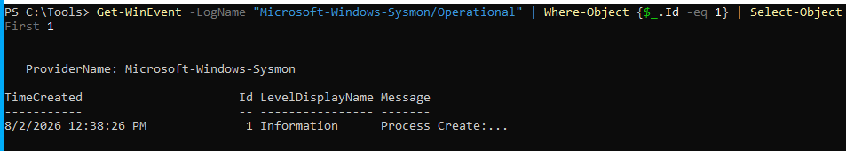

---

### Event ID 3

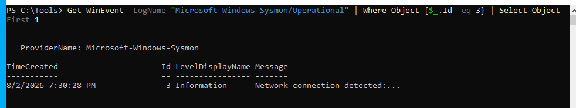

---

### Event ID 22

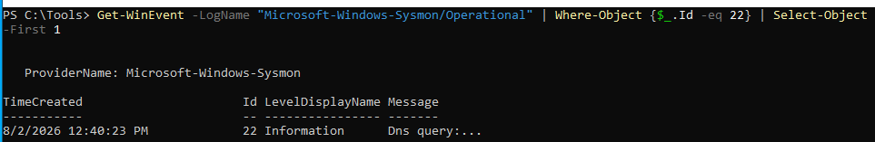

---

# 3. Universal Forwarder Deployment

## 3.1 Deployment

The Splunk Universal Forwarder was installed on the monitored Windows endpoint to forward Windows Event Logs and Sysmon telemetry to the central Splunk SIEM.

---

## 3.2 Configuration

The Universal Forwarder was configured to forward logs to:

- Splunk Server: `10.0.10.10`
- Receiving Port: `9997`

The following log sources were enabled:

- Windows Security
- Windows System
- Windows Application
- Microsoft-Windows-Sysmon/Operational

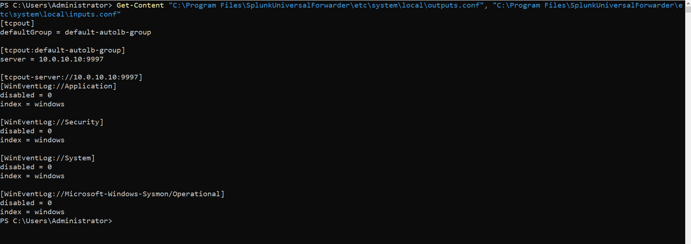

---

## 3.3 Service Validation

The `SplunkForwarder` service was verified and confirmed to be running successfully.

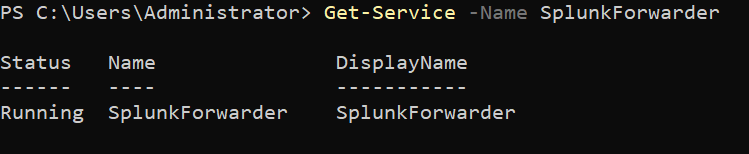

---

## 3.4 Log Validation

The forwarded Windows and Sysmon events were successfully received and indexed by the Splunk server.

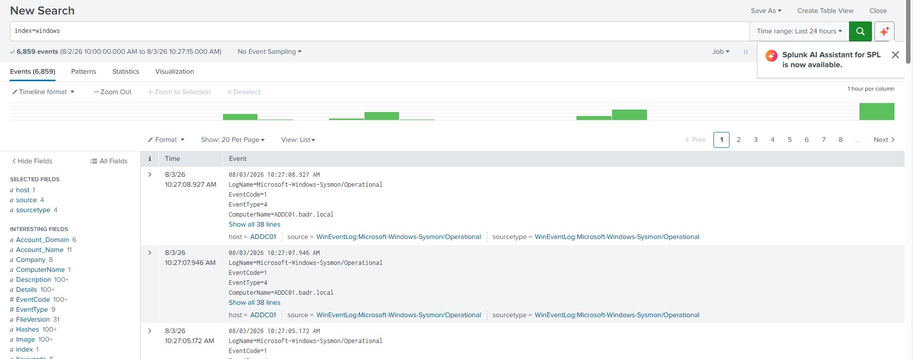

---
# 4. Validation Summary

| Component | Status |
|----------|--------|
| Splunk Installed | ✅ |
| Splunk Service Running | ✅ |
| Dedicated Indexes Created | ✅ |
| TCP 9997 Enabled | ✅ |
| Windows Sourcetypes Verified | ✅ |
| Time Synchronization Verified | ✅ |
| Sysmon Installed | ✅ |
| SwiftOnSecurity Configuration Applied | ✅ |
| Sysmon Operational Logs Available | ✅ |
| Critical Event IDs Verified | ✅ |

---

# 5. Lessons Learned

- Splunk indexes should be separated according to the type of collected telemetry.
- TCP port 9997 is the standard receiving port for Splunk Universal Forwarders.
- Accurate time synchronization is critical for event correlation and incident timeline reconstruction.
- Sysmon significantly enhances Windows endpoint visibility compared to default Windows Event Logs.
- Verifying telemetry before forwarding logs simplifies troubleshooting during later deployment stages.
