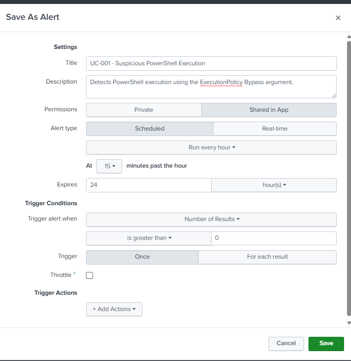
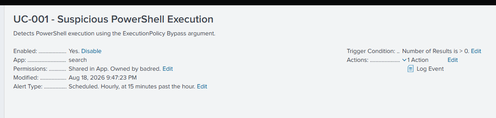

# UC-001 — Suspicious PowerShell Execution

## Objective

Detect PowerShell executions using the `-ExecutionPolicy Bypass` argument.

---

## MITRE ATT&CK

| Tactic | Technique | ID |
|---------|-----------|----|
| Execution | PowerShell | T1059.001 |

---

## Data Source

- Sysmon Event ID 1 (Process Creation)

---

## Detection Logic

The following SPL query detects PowerShell executions using the `-ExecutionPolicy Bypass` argument.

```spl
index=windows EventCode=1 Image="*powershell.exe" CommandLine="*Bypass*"
| table _time User ParentImage CommandLine ComputerName
```


---

## Test Performed

The following command was executed on the monitored Windows endpoint.

```powershell
powershell.exe -ExecutionPolicy Bypass
```


---

## Result

The SPL query successfully detected the generated event.

---

## Investigation Summary

| Field | Value |
|--------|-------|
| User | BADR\Administrator |
| Computer | ADDC01.badr.local |
| Parent Process | powershell.exe |
| Process | powershell.exe |
| Command Line | powershell.exe -ExecutionPolicy Bypass |

---

## 5W1H Analysis

| Question | Analysis |
|---|---|
| **Who?** | `BADR\Administrator` |
| **What?** | PowerShell was executed with the `-ExecutionPolicy Bypass` argument. |
| **When?** | The activity occurred during the controlled UC-001 test and was recorded by Sysmon Event ID 1. |
| **Where?** | The execution occurred on `ADDC01.badr.local`. |
| **Why?** | The command was intentionally executed as part of the SOC lab to simulate suspicious PowerShell behavior and validate the detection capability. |
| **How?** | `powershell.exe` was launched with `-ExecutionPolicy Bypass`, generating a Sysmon Process Creation event that was forwarded to Splunk. |

---

## 5 WHY Analysis

### 1. Why was the event detected?

Because PowerShell was executed with the `-ExecutionPolicy Bypass` argument.

### 2. Why is `ExecutionPolicy Bypass` considered suspicious?

Because it allows PowerShell to execute without enforcing the configured execution policy and can therefore appear in malicious or unauthorized script execution.

### 3. Why was PowerShell executed with this argument?

In this scenario, the administrator intentionally executed the command to simulate suspicious PowerShell activity in the controlled SOC lab.

### 4. Why was this simulation performed?

To verify that Sysmon could capture the process execution and that Splunk could identify the suspicious command-line argument.

### 5. Why is detecting this behavior important?

Because monitoring suspicious PowerShell command-line arguments can help SOC analysts identify potentially malicious execution while still requiring investigation to distinguish legitimate administrative activity from an actual attack.

---

## Splunk Detection Rule

The validated detection query was converted into a scheduled Splunk alert to automate the detection of this behavior.

### Detection Query

```spl
index=windows EventCode=1 Image="*powershell.exe" CommandLine="*Bypass*"
| table _time User ParentImage Image CommandLine ComputerName
```

### Alert Configuration

| Setting | Value |
|---|---|
| Alert Name | `UC-001 - Suspicious PowerShell Execution` |
| Alert Type | Scheduled |
| Schedule | Hourly, at 15 minutes past the hour |
| Trigger Condition | Number of Results > 0 |
| Trigger Action | Log Event |
| Status | Enabled |





The detection rule allows Splunk to automatically evaluate the suspicious behavior instead of requiring the analyst to manually execute the search.

---

## Containment

Because the detected activity was intentionally generated during an authorized laboratory test, no real containment action was required.

In a real incident, if the activity were confirmed as unauthorized, appropriate containment actions could include:

- Isolating the affected endpoint from the network.
- Terminating the suspicious PowerShell process.
- Temporarily disabling or restricting the compromised user account if necessary.
- Preserving relevant logs and evidence for further investigation.

---

## Eradication

No eradication action was required in the laboratory because no malicious payload or persistent threat was introduced.

For a confirmed malicious incident, eradication could include:

- Removing malicious scripts or files identified during the investigation.
- Removing unauthorized persistence mechanisms if discovered.
- Resetting compromised credentials when applicable.
- Verifying that no additional malicious processes remain on the endpoint.

---

## Recovery

No system recovery was required because the laboratory endpoint was not compromised.

In a real incident, recovery would include:

- Reconnecting the endpoint after confirming that it is clean.
- Restoring normal user access.
- Verifying that security controls and logging remain operational.
- Increasing monitoring of the affected endpoint for additional suspicious activity.

---

## Post-Incident Activity

Following the investigation, the detection logic and collected telemetry were reviewed.

### Lessons Learned

- PowerShell execution alone should not automatically be classified as malicious.
- Command-line arguments provide important context during investigation.
- `ExecutionPolicy Bypass` should be treated as a suspicious indicator requiring additional analysis.
- Sysmon Event ID 1 provides useful process creation telemetry for PowerShell investigations.
- Automated Splunk detection reduces the need for repetitive manual searches.

### Recommendations

- Continue monitoring suspicious PowerShell command-line arguments.
- Correlate PowerShell activity with user, parent process, network, and file activity when available.
- Review legitimate administrative PowerShell usage to reduce false positives.
- Periodically review and tune the Splunk detection rule.

---

## Final Incident Classification

| Field | Result |
|---|---|
| Detection | Successful |
| Investigation | Completed |
| MITRE ATT&CK | `T1059.001 - PowerShell` |
| Detection Rule | Enabled |
| Containment | Not required – controlled simulation |
| Eradication | Not required – controlled simulation |
| Recovery | Not required – system unaffected |
| Final Classification | Benign / Authorized Lab Simulation |

The activity matched behavior that may be observed during malicious PowerShell execution. However, investigation confirmed that the event was intentionally generated during an authorized SOC laboratory test.

---

## Analyst Conclusion

The event was intentionally generated by the administrator during lab testing.

Although the `-ExecutionPolicy Bypass` argument is commonly associated with attacker activity, this event is classified as **Benign** because it was executed in a controlled laboratory environment.

---

## Detection Status

| Item | Status |
|------|--------|
| Detection Query | ✅ |
| Test Executed | ✅ |
| Event Detected | ✅ |
| Investigation Completed | ✅ |
