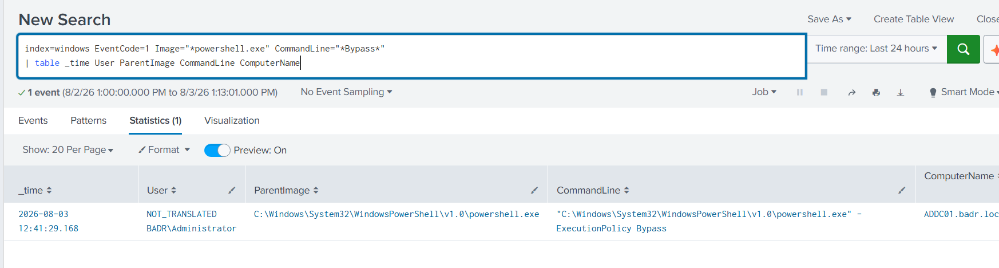
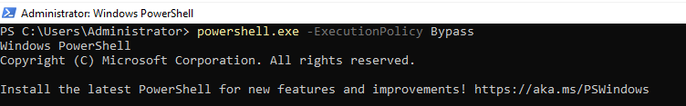

# UC-001 — Suspicious PowerShell Execution

## Objective

Detect PowerShell executions using the `-ExecutionPolicy Bypass` argument.

---

## MITRE ATT&CK

| Tactic | Technique | ID |
|---------|-----------|----|
| Execution | PowerShell | T1059.001 |

---

## Data Source

- Sysmon Event ID 1 (Process Creation)

---

## Detection Logic

The following SPL query detects PowerShell executions using the `-ExecutionPolicy Bypass` argument.

```spl
index=windows EventCode=1 Image="*powershell.exe" CommandLine="*Bypass*"
| table _time User ParentImage CommandLine ComputerName
```



---

## Test Performed

The following command was executed on the monitored Windows endpoint.

```powershell
powershell.exe -ExecutionPolicy Bypass
```



---

## Result

The SPL query successfully detected the generated event.

---

## Investigation Summary

| Field | Value |
|--------|-------|
| User | BADR\Administrator |
| Computer | ADDC01.badr.local |
| Parent Process | powershell.exe |
| Process | powershell.exe |
| Command Line | powershell.exe -ExecutionPolicy Bypass |

---

## Analyst Conclusion

The event was intentionally generated by the administrator during lab testing.

Although the `-ExecutionPolicy Bypass` argument is commonly associated with attacker activity, this event is classified as **Benign** because it was executed in a controlled laboratory environment.

---

## Detection Status

| Item | Status |
|------|--------|
| Detection Query | ✅ |
| Test Executed | ✅ |
| Event Detected | ✅ |
| Investigation Completed | ✅ |
