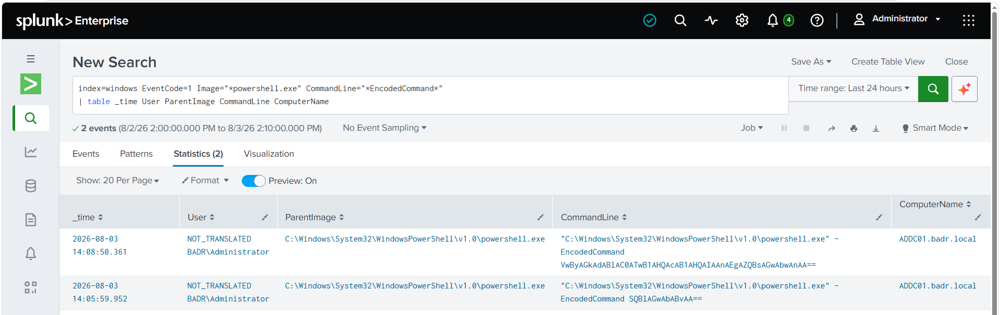
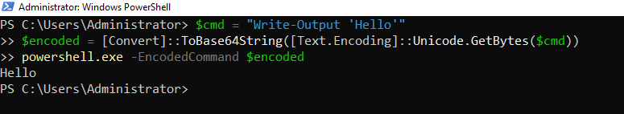
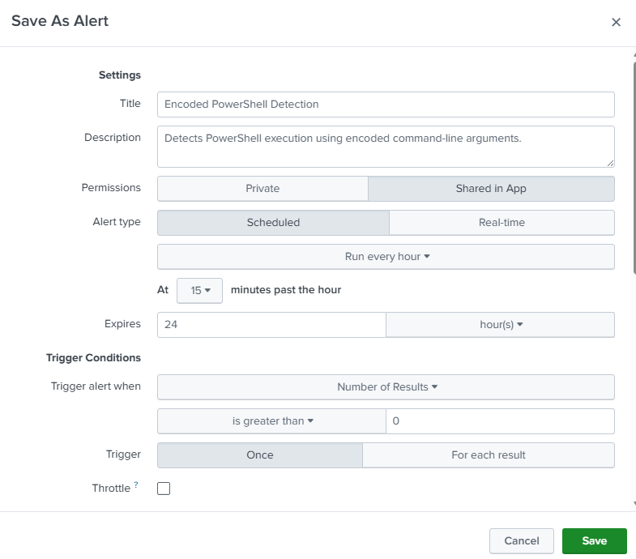
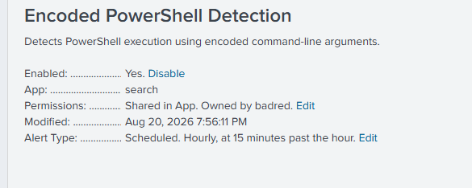

# UC-002 — Encoded PowerShell Detection

## Objective

Detect PowerShell processes executed with an encoded command, a technique commonly used to hide command content and evade basic inspection.

---

## MITRE ATT&CK

| Tactic | Technique | ID |
|---|---|---|
| Execution | PowerShell | T1059.001 |
| Defense Evasion | Obfuscated/Compressed Files and Information | T1027 |

---

## Data Source

- Sysmon Event ID 1 — Process Creation

---

## Detection Logic

The detection searches for PowerShell process-creation events whose command line contains the `-EncodedCommand` or shortened `-enc` argument.

---

## SPL Query

```spl
index=windows EventCode=1 Image="*powershell.exe"
(CommandLine="*-EncodedCommand*" OR CommandLine="*-enc*")
| table _time User ParentImage Image CommandLine ComputerName
```

### Detection Evidence



---

## Test Performed

A harmless PowerShell command was encoded using UTF-16LE Base64 and executed with the `-EncodedCommand` argument.

```powershell
$cmd = "Write-Output 'Hello'"
$encoded = [Convert]::ToBase64String(
    [Text.Encoding]::Unicode.GetBytes($cmd)
)
powershell.exe -EncodedCommand $encoded
```

### Test Evidence



---

## Result

Sysmon recorded the PowerShell process creation, including the encoded command-line argument. The event was forwarded to Splunk, and the SPL query successfully returned the matching event.

---

## Investigation Summary

| Field | Finding |
|---|---|
| Process | `powershell.exe` |
| Suspicious argument | `-EncodedCommand` |
| Data source | Sysmon Event ID 1 |
| Environment | Controlled SOC laboratory |
| Classification | Benign test activity |

---

## 5W1H Analysis

| Question | Analysis |
|---|---|
| **Who?** | `BADR\Administrator` |
| **What?** | PowerShell executed a Base64-encoded command using the `-EncodedCommand` argument. |
| **When?** | The activity occurred during the controlled UC-002 test and was recorded by Sysmon Event ID 1. |
| **Where?** | The execution occurred on `ADDC01.badr.local`. |
| **Why?** | The command was intentionally executed to simulate encoded PowerShell activity and validate the SOC detection capability. |
| **How?** | A harmless command was encoded using UTF-16LE Base64 and passed to `powershell.exe` through the `-EncodedCommand` argument. |

---

## 5 WHY Analysis

### 1. Why was the event detected?

Because `powershell.exe` was executed with an encoded command-line argument.

### 2. Why is an encoded PowerShell command suspicious?

Because encoding can hide the actual command content from basic inspection and is also used by attackers to obfuscate malicious commands.

### 3. Why was an encoded command executed in this scenario?

It was intentionally generated during the controlled SOC lab to simulate suspicious PowerShell behavior.

### 4. Why was this simulation performed?

To verify that Sysmon captures the process execution and that Splunk can identify the encoded PowerShell command line.

### 5. Why is detecting this behavior important?

Because encoded PowerShell commands may indicate obfuscated execution and should be investigated to determine whether the underlying activity is legitimate or malicious.

---

## Splunk Detection Rule

The validated SPL query was converted into a scheduled Splunk alert to automatically detect encoded PowerShell execution.

### Detection Query

```spl
index=windows EventCode=1 Image="*powershell.exe"
(CommandLine="*-EncodedCommand*" OR CommandLine="*-enc*")
| table _time User ParentImage Image CommandLine ComputerName
```

### Alert Configuration

| Setting | Value |
|---|---|
| Alert Name | `UC-002 - Encoded PowerShell Detection` |
| Alert Type | Scheduled |
| Schedule | Hourly, at 15 minutes past the hour |
| Trigger Condition | Number of Results > 0 |
| Trigger Action | Log Event |
| Status | Enabled |

### Alert Evidence





The alert automates the detection process so that the SOC analyst does not need to manually execute the SPL query.

---

## Containment

Because the encoded PowerShell activity was intentionally generated during an authorized laboratory test, no containment action was required.

In a real incident, if the execution were confirmed as unauthorized, containment could include:

- Isolating the affected endpoint.
- Terminating suspicious PowerShell processes.
- Restricting the affected user account if compromise is suspected.
- Preserving relevant telemetry for further investigation.

---

## Eradication

No eradication was required because the encoded command used in the test was harmless and introduced no malicious payload or persistence.

For confirmed malicious activity, eradication could include:

- Removing identified malicious scripts or payloads.
- Removing persistence mechanisms associated with the activity.
- Resetting compromised credentials when applicable.
- Searching for related malicious PowerShell activity on other endpoints.

---

## Recovery

No recovery action was required because the endpoint remained operational and uncompromised during the controlled simulation.

In a real incident, recovery could include:

- Confirming that the endpoint is clean before restoring normal access.
- Re-enabling affected accounts or services after validation.
- Verifying that Sysmon and security monitoring remain operational.
- Increasing monitoring for repeated encoded PowerShell activity.

---

## Post-Incident Activity

### Lessons Learned

- Encoded PowerShell commands are not automatically malicious.
- Base64 encoding can reduce command visibility and therefore requires additional investigation.
- Sysmon Event ID 1 provides the command-line telemetry required to detect this behavior.
- Parent process, user context, and the decoded command content should be reviewed before classifying the event.
- Automated Splunk alerts improve the detection workflow compared with repetitive manual searches.

### Recommendations

- Monitor PowerShell executions using `-EncodedCommand`, `-enc`, and similar arguments.
- Decode suspicious Base64 content during investigation when appropriate.
- Correlate PowerShell execution with process, network, file, and user activity.
- Establish legitimate administrative PowerShell baselines to reduce false positives.
- Periodically review and tune the detection rule.

---

## Final Incident Classification

| Field | Result |
|---|---|
| Detection | Successful |
| Investigation | Completed |
| MITRE ATT&CK | `T1059.001 - PowerShell` / `T1027 - Obfuscated Files or Information` |
| Detection Rule | Enabled |
| Containment | Not required – controlled simulation |
| Eradication | Not required – harmless test command |
| Recovery | Not required – system unaffected |
| Final Classification | Benign / Authorized Lab Simulation |

The behavior matched a technique commonly associated with command obfuscation. However, investigation confirmed that the encoded PowerShell execution was intentionally generated as part of the authorized SOC laboratory validation.

---

## Analyst Conclusion

Encoded PowerShell is not automatically malicious, but it reduces command visibility and is frequently associated with attacker activity.

This event was classified as **benign** because it was intentionally generated during controlled detection validation. In a production environment, the analyst should decode the Base64 content and examine the user, parent process, host, and related network activity.

---

## Detection Status

| Item | Status |
|---|---|
| Test executed | ✅ |
| Event collected | ✅ |
| SPL detection successful | ✅ |
| Investigation completed | ✅ |
