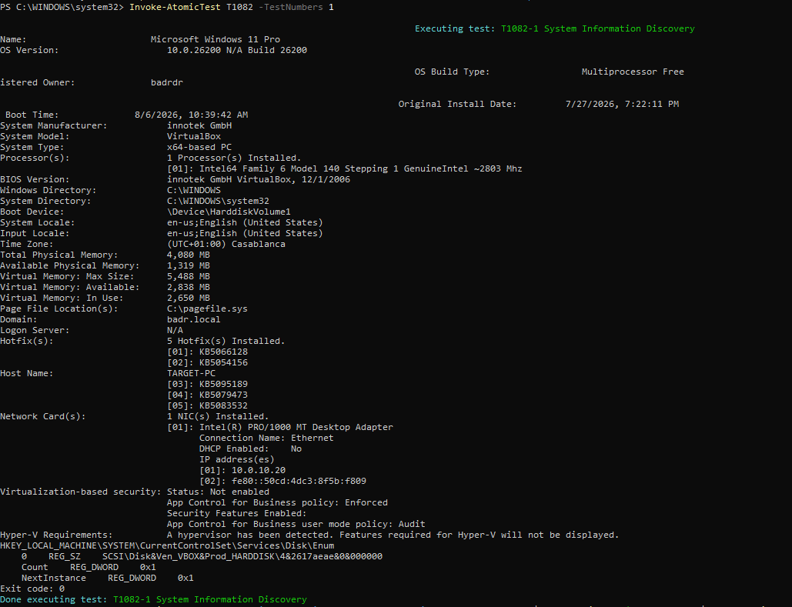
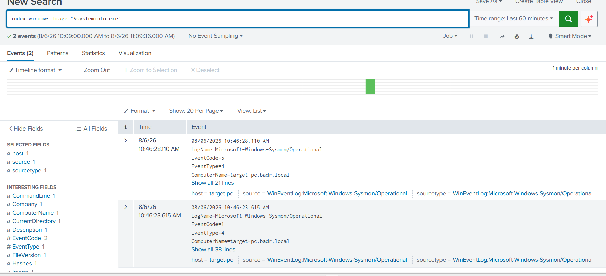
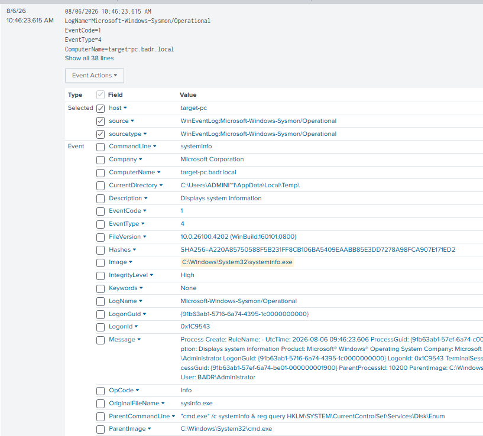

# UC-003 — System Information Discovery

## Objective

Detect system information discovery activity performed on a Windows endpoint using Sysmon telemetry and Splunk SIEM.

---

## MITRE ATT&CK

| Tactic | Technique | ID |
|---------|-----------|----|
| Discovery | System Information Discovery | T1082 |

---

## Attack Description

An Atomic Red Team test (T1082-1) was executed in a controlled laboratory environment to simulate system information discovery activity.

The attack executed the `systeminfo.exe` command to retrieve details about the operating system, hardware, installed updates, and system configuration.

---

## Data Source

- Sysmon Event ID 1 (Process Creation)

---

## Detection Query

```spl
index=windows EventCode=1 Image="*systeminfo.exe"
| table _time User ComputerName ParentImage Image CommandLine
```

---

## Detection Evidence

### Atomic Red Team Execution



---

### Splunk Detection



---

### Event Details



---

## Investigation

| Field | Value |
|--------|-------|
| Technique | T1082 |
| Event ID | 1 |
| Process | systeminfo.exe |
| Parent Process | cmd.exe |
| User | BADR\Administrator |
| Host | target-pc |
| Integrity Level | High |

---

## 5 WHY Analysis

### Problem

System information discovery activity was detected.

### Why 1

Why was `systeminfo.exe` executed?

Because a command was launched to collect operating system information.

### Why 2

Why collect operating system information?

To understand the target environment.

### Why 3

Why is understanding the environment important?

Attackers need system details before choosing the next attack technique.

### Why 4

Why perform this before privilege escalation or persistence?

To determine which techniques are compatible with the operating system.

### Why 5

Why should defenders monitor this behavior?

Because reconnaissance is usually one of the first stages of an attack.

### Root Cause

Execution of a reconnaissance command (`systeminfo.exe`) on the endpoint.

---

## Analyst Conclusion

The detection successfully identified execution of the Windows **systeminfo.exe** utility through Sysmon Event ID 1.

During this laboratory, the activity was intentionally generated using Atomic Red Team for detection validation.

In a production environment, repeated or unexpected execution of system discovery commands should be investigated because they may indicate attacker reconnaissance before lateral movement or privilege escalation.

---

## Detection Status

| Item | Status |
|------|--------|
| Attack Executed | ✅ |
| Sysmon Logged Event | ✅ |
| Splunk Detection | ✅ |
| Investigation Completed | ✅ |
| MITRE Mapping | ✅ |
| 5 WHY Analysis | ✅ |
