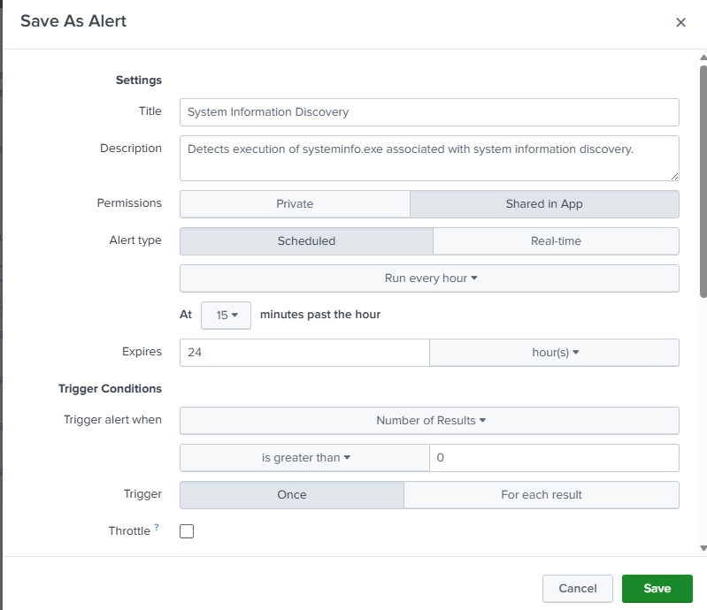
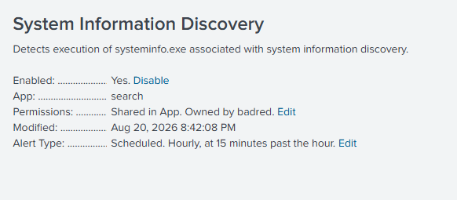

# UC-003 — System Information Discovery

## Objective

Detect system information discovery activity performed on a Windows endpoint using Sysmon telemetry and Splunk SIEM.

---

## MITRE ATT&CK

| Tactic | Technique | ID |
|---------|-----------|----|
| Discovery | System Information Discovery | T1082 |

---

## Attack Description

An Atomic Red Team test (T1082-1) was executed in a controlled laboratory environment to simulate system information discovery activity.

The attack executed the `systeminfo.exe` command to retrieve details about the operating system, hardware, installed updates, and system configuration.

---

## Data Source

- Sysmon Event ID 1 (Process Creation)

---

## Detection Query

```spl
index=windows EventCode=1 Image="*systeminfo.exe"
| table _time ComputerName User ParentImage Image CommandLine
```

---

## Detection Evidence

### Atomic Red Team Execution


---

### Splunk Detection


---

### Event Details


---

## Investigation

| Field | Value |
|--------|-------|
| Technique | T1082 |
| Event ID | 1 |
| Process | systeminfo.exe |
| Parent Process | cmd.exe |
| User | BADR\Administrator |
| Host | target-pc |
| Integrity Level | High |

---

## 5 WHY Analysis

### Problem

System information discovery activity was detected.

### Why 1

Why was `systeminfo.exe` executed?

Because a command was launched to collect operating system information.

### Why 2

Why collect operating system information?

To understand the target environment.

### Why 3

Why is understanding the environment important?

Attackers need system details before choosing the next attack technique.

### Why 4

Why perform this before privilege escalation or persistence?

To determine which techniques are compatible with the operating system.

### Why 5

Why should defenders monitor this behavior?

Because reconnaissance is usually one of the first stages of an attack.

### Root Cause

Execution of a reconnaissance command (`systeminfo.exe`) on the endpoint.

---

## 5W1H Analysis

| Question | Analysis |
|---|---|
| **Who?** | `BADR\Administrator` |
| **What?** | The `systeminfo.exe` utility was executed to collect information about the Windows system. |
| **When?** | The activity occurred during the controlled UC-003 Atomic Red Team simulation and was captured by Sysmon Event ID 1. |
| **Where?** | The execution occurred on `target-pc`. |
| **Why?** | The activity was intentionally generated to simulate system reconnaissance and validate the SOC detection capability. |
| **How?** | Atomic Red Team executed `systeminfo.exe`, generating a process creation event that was forwarded to Splunk. |

---

## Splunk Detection Rule

The validated SPL query was converted into a scheduled Splunk alert to automatically detect execution of `systeminfo.exe`.

### Detection Query

```spl
index=windows EventCode=1 Image="*systeminfo.exe"
| table _time ComputerName User ParentImage Image CommandLine
```

### Alert Configuration

| Setting | Value |
|---|---|
| Alert Name | `UC-003 - System Information Discovery` |
| Alert Type | Scheduled |
| Schedule | Hourly, at 15 minutes past the hour |
| Trigger Condition | Number of Results > 0 |
| Trigger Action | Log Event |
| Status | Enabled |

### Alert Evidence





The rule automates identification of system information discovery activity and reduces the need for repetitive manual searches.

---

## Containment

No containment action was required because the activity was intentionally generated in the controlled SOC laboratory.

In a real incident, if the discovery activity were confirmed as unauthorized, containment could include:

- Isolating the affected endpoint if additional malicious activity is observed.
- Restricting the affected account when compromise is suspected.
- Preserving relevant endpoint and SIEM telemetry for investigation.

---

## Eradication

No eradication action was required because `systeminfo.exe` is a legitimate Windows utility and no malicious payload or persistence mechanism was introduced.

For confirmed malicious activity:

- Identify and remove any malicious processes or files associated with the discovery activity.
- Investigate the process responsible for launching the discovery command.
- Remove persistence mechanisms if discovered.
- Reset compromised credentials when applicable.

---

## Recovery

No recovery action was required because the endpoint remained operational and uncompromised.

In a real incident:

- Confirm that the endpoint is clean before returning it to normal operation.
- Restore affected accounts or services when appropriate.
- Verify that Sysmon and Splunk telemetry remain operational.
- Monitor the endpoint for additional discovery or post-compromise activity.

---

## Post-Incident Activity

### Lessons Learned

- `systeminfo.exe` is a legitimate Windows utility and its execution alone does not prove malicious activity.
- System discovery can be an early indicator of attacker reconnaissance.
- User context, parent process, command line, and surrounding activity are important for determining intent.
- Sysmon Event ID 1 provides useful telemetry for detecting system discovery.
- Automated Splunk detection improves visibility into this behavior.

### Recommendations

- Monitor unexpected execution of system discovery utilities.
- Correlate discovery activity with suspicious PowerShell, authentication, persistence, and lateral movement events.
- Establish a baseline of legitimate administrative activity to reduce false positives.
- Periodically review and tune the detection rule.

---

## Final Incident Classification

| Field | Result |
|---|---|
| Detection | Successful |
| Investigation | Completed |
| MITRE ATT&CK | `T1082 - System Information Discovery` |
| Detection Rule | Enabled |
| Containment | Not required – controlled simulation |
| Eradication | Not required – no malicious artifact |
| Recovery | Not required – system unaffected |
| Final Classification | Benign / Authorized Lab Simulation |

The detection successfully identified system information discovery activity. Investigation confirmed that the execution was intentionally generated using Atomic Red Team as part of the authorized SOC laboratory validation.

---

## Analyst Conclusion

The detection successfully identified execution of the Windows **systeminfo.exe** utility through Sysmon Event ID 1.

During this laboratory, the activity was intentionally generated using Atomic Red Team for detection validation.

In a production environment, repeated or unexpected execution of system discovery commands should be investigated because they may indicate attacker reconnaissance before lateral movement or privilege escalation.

The analyst should also verify the parent process, execution context, user account, and correlate this event with other discovery activities before determining malicious intent.

---

## Detection Status

| Item | Status |
|------|--------|
| Attack Executed | ✅ |
| Sysmon Logged Event | ✅ |
| Splunk Detection | ✅ |
| Investigation Completed | ✅ |
| MITRE Mapping | ✅ |
| 5 WHY Analysis | ✅ |
