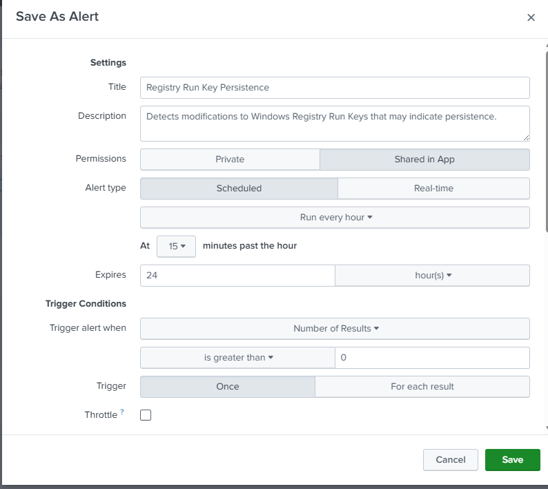
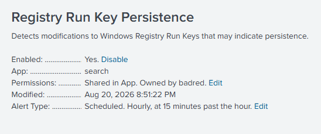

# UC-004 — Registry Run Key Persistence

## Objective

Detect Windows Registry Run Key persistence activity using Sysmon telemetry and Splunk SIEM.

---

## MITRE ATT&CK

| Tactic | Technique | ID |
|---------|-----------|----|
| Persistence | Registry Run Keys / Startup Folder | T1547.001 |

Reference:
https://attack.mitre.org/techniques/T1547/001/

---

## Attack Description

An Atomic Red Team test (T1547.001-1) was executed in a controlled laboratory environment to simulate Registry Run Key persistence.

The attack created a Registry Run Key under the current user profile to automatically execute a program when the user logs in.

---

## Data Source

- Sysmon Event ID 13 (Registry Value Set)

---

## Detection Query

```spl
index=windows EventCode=13
| table _time ComputerName User TargetObject Details Image ProcessGuid
| sort -_time
```

---

## Detection Evidence

### Atomic Red Team Execution


---

### Splunk Detection


---

### Event Details


---

## Investigation

| Field | Value |
|--------|-------|
| Technique | T1547.001 |
| Event ID | 13 |
| Registry Value | Atomic Red Team |
| Registry Path | HKCU\Software\Microsoft\Windows\CurrentVersion\Run |
| Executable | C:\Path\AtomicRedTeam.exe |
| Process | reg.exe |
| User | BADR\Administrator |
| Host | target-pc |

---

## 5 WHY Analysis

### Problem

Persistence activity was detected through modification of a Registry Run Key.

### Why 1

Why was the Registry modified?

Because a new Run Key was created.

### Why 2

Why create a Run Key?

To automatically execute a program whenever the user logs on.

### Why 3

Why does an attacker want automatic execution?

To maintain persistence after the initial compromise.

### Why 4

Why is persistence important?

It allows the attacker to regain access without exploiting the system again.

### Why 5

Why should SOC analysts monitor Registry Run Keys?

Because they are one of the most common Windows persistence mechanisms used by attackers and malware.

### Root Cause

A Registry Run Key was created to automatically launch an executable at user logon.

---

## 5W1H Analysis

| Question | Analysis |
|---|---|
| **Who?** | `BADR\Administrator` |
| **What?** | A new Registry Run Key value named `Atomic Red Team` was created to automatically execute an executable when the user logs on. |
| **When?** | The activity occurred during the controlled UC-004 Atomic Red Team simulation and was captured by Sysmon Event ID 13. |
| **Where?** | The modification occurred on `target-pc` under `HKCU\Software\Microsoft\Windows\CurrentVersion\Run`. |
| **Why?** | The modification was intentionally generated to simulate a common Windows persistence technique and validate SOC detection. |
| **How?** | `reg.exe` modified the Registry Run Key and configured `C:\Path\AtomicRedTeam.exe` for automatic execution at user logon. |

---

## Splunk Detection Rule

The validated detection logic was converted into a scheduled Splunk alert to automatically identify modifications to Windows Registry Run Keys.

### Detection Query

```spl
index=windows EventCode=13
TargetObject="*\\Software\\Microsoft\\Windows\\CurrentVersion\\Run*"
| table _time ComputerName User Image TargetObject Details ProcessGuid
| sort -_time
```

### Alert Configuration

| Setting | Value |
|---|---|
| Alert Name | `UC-004 - Registry Run Key Persistence` |
| Alert Type | Scheduled |
| Schedule | Hourly, at 15 minutes past the hour |
| Trigger Condition | Number of Results > 0 |
| Trigger Action | Log Event |
| Status | Enabled |

### Alert Evidence





The rule provides automated visibility into Registry Run Key modifications that may represent persistence activity.

---

## Containment

Because this activity was generated during an authorized laboratory simulation, no emergency containment was required.

In a real incident, an unexpected Registry Run Key modification would require additional investigation. If confirmed as malicious, containment actions could include:

- Isolating the affected endpoint from the network.
- Restricting the affected user account if compromise is suspected.
- Preventing execution of the executable referenced by the Registry value.
- Preserving the Registry value and associated telemetry as evidence before removal.

---

## Eradication

Unlike the previous discovery simulations, this technique creates a persistent system modification. Therefore, the unauthorized Registry Run Key should be removed after evidence has been collected.

For a confirmed malicious incident, eradication would include:

- Removing the malicious Registry Run Key value.
- Identifying and removing the executable referenced by the Registry value if malicious.
- Investigating the process responsible for creating the persistence mechanism.
- Searching other endpoints for the same Registry value or executable.
- Resetting compromised credentials if required.

In this laboratory, the Atomic Red Team cleanup procedure can be used to restore the environment after the persistence test.

---

## Recovery

After removing the persistence mechanism:

- Verify that the Registry Run Key no longer contains the unauthorized value.
- Confirm that the referenced executable is no longer automatically launched at logon.
- Verify that the endpoint remains operational.
- Confirm that Sysmon and Splunk logging continue to function.
- Return the endpoint to normal operation after validation.

---

## Post-Incident Activity

### Lessons Learned

- Registry Run Keys provide a legitimate Windows functionality but can also be abused for persistence.
- Sysmon Event ID 13 provides visibility into Registry value modifications.
- Monitoring the Registry path is more reliable than detecting only a specific process such as `reg.exe`.
- Registry changes should be correlated with the user, process, executable path, and surrounding activity.
- Persistence detection is important because it may reveal an attempt to maintain access after initial compromise.

### Recommendations

- Monitor modifications to Windows `Run` and `RunOnce` Registry locations.
- Investigate unexpected executables referenced by Registry autorun entries.
- Establish a baseline of legitimate startup applications.
- Correlate persistence events with previous execution and authentication activity.
- Search other endpoints for matching persistence indicators when malicious activity is confirmed.
- Periodically review and tune the Splunk detection rule to reduce false positives.

---

## Final Incident Classification

| Field | Result |
|---|---|
| Detection | Successful |
| Investigation | Completed |
| MITRE ATT&CK | `T1547.001 - Registry Run Keys / Startup Folder` |
| Detection Rule | Enabled |
| Containment | Not required – controlled simulation |
| Eradication | Cleanup required to remove simulated persistence |
| Recovery | Verify Registry state after cleanup |
| Final Classification | Benign / Authorized Lab Simulation |

The detection successfully identified a Registry Run Key modification associated with persistence behavior. Investigation confirmed that the activity was intentionally generated using Atomic Red Team in the controlled SOC laboratory.

Although the activity was authorized, the persistence artifact should be cleaned up after testing to restore the endpoint to its original state.

---

## Detection Logic

This detection is based on persistence behavior rather than only process execution.

Instead of detecting every execution of **reg.exe**, the rule focuses on registry modifications to the Windows Run Key.

Detection Indicators:

- Process: reg.exe
- Event ID: 13 (Registry Value Set)
- Registry Path: HKCU\Software\Microsoft\Windows\CurrentVersion\Run
- Registry Value: Atomic Red Team

This approach reduces false positives and provides a more reliable detection of persistence activity.

---

## Analyst Conclusion

Splunk successfully detected the Registry Run Key modification through Sysmon Event ID 13.

The event showed that **reg.exe** created a new value named **Atomic Red Team** inside the Windows Run Key.

During this laboratory, the activity was intentionally generated using Atomic Red Team to validate persistence detection.

In a production environment, any unexpected modification of Registry Run Keys should be investigated because it may indicate malware persistence.

---

## Detection Status

| Item | Status |
|------|--------|
| Attack Executed | ✅ |
| Registry Modified | ✅ |
| Sysmon Logged Event | ✅ |
| Splunk Detection | ✅ |
| Investigation Completed | ✅ |
| MITRE Mapping | ✅ |
| 5 WHY Analysis | ✅ |
