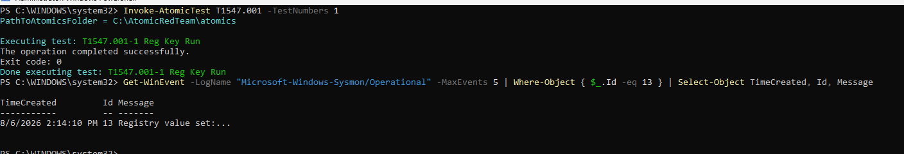
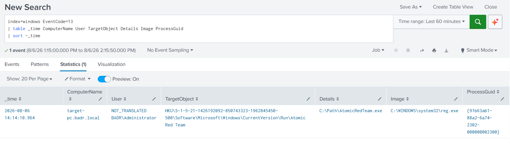
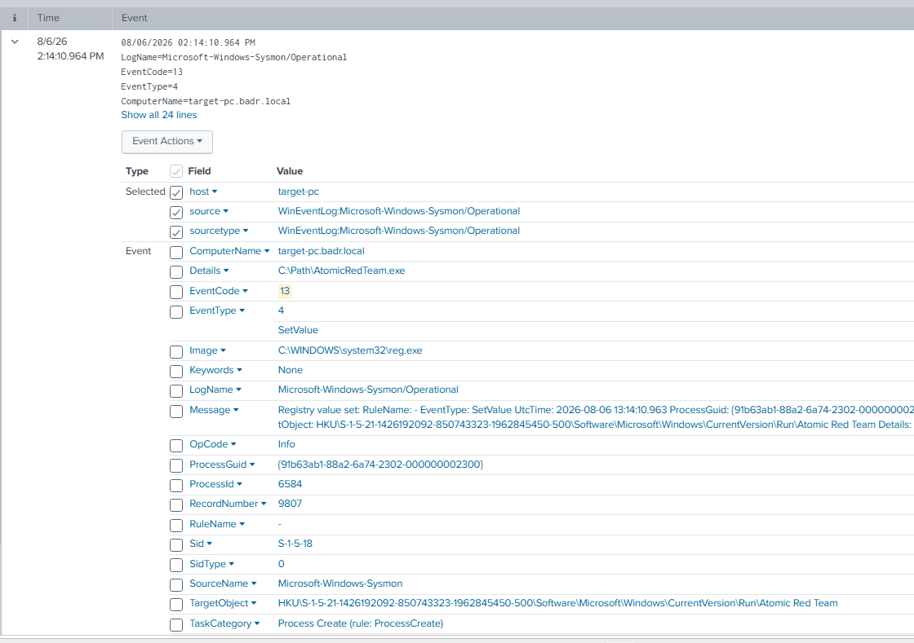

# UC-004 — Registry Run Key Persistence

## Objective

Detect Windows Registry Run Key persistence activity using Sysmon telemetry and Splunk SIEM.

---

## MITRE ATT&CK

| Tactic | Technique | ID |
|---------|-----------|----|
| Persistence | Registry Run Keys / Startup Folder | T1547.001 |

Reference:
https://attack.mitre.org/techniques/T1547/001/

---

## Attack Description

An Atomic Red Team test (T1547.001-1) was executed in a controlled laboratory environment to simulate Registry Run Key persistence.

The attack created a Registry Run Key under the current user profile to automatically execute a program when the user logs in.

---

## Data Source

- Sysmon Event ID 13 (Registry Value Set)

---

## Detection Query

```spl
index=windows EventCode=13
| table _time ComputerName User TargetObject Details Image ProcessGuid
| sort -_time
```

---

## Detection Evidence

### Atomic Red Team Execution



---

### Splunk Detection



---

### Event Details



---

## Investigation

| Field | Value |
|--------|-------|
| Technique | T1547.001 |
| Event ID | 13 |
| Registry Value | Atomic Red Team |
| Registry Path | HKCU\Software\Microsoft\Windows\CurrentVersion\Run |
| Executable | C:\Path\AtomicRedTeam.exe |
| Process | reg.exe |
| User | BADR\Administrator |
| Host | target-pc |

---

## 5 WHY Analysis

### Problem

Persistence activity was detected through modification of a Registry Run Key.

### Why 1

Why was the Registry modified?

Because a new Run Key was created.

### Why 2

Why create a Run Key?

To automatically execute a program whenever the user logs on.

### Why 3

Why does an attacker want automatic execution?

To maintain persistence after the initial compromise.

### Why 4

Why is persistence important?

It allows the attacker to regain access without exploiting the system again.

### Why 5

Why should SOC analysts monitor Registry Run Keys?

Because they are one of the most common Windows persistence mechanisms used by attackers and malware.

### Root Cause

A Registry Run Key was created to automatically launch an executable at user logon.

---

## Detection Logic

This detection is based on persistence behavior rather than only process execution.

Instead of detecting every execution of **reg.exe**, the rule focuses on registry modifications to the Windows Run Key.

Detection Indicators:

- Process: reg.exe
- Event ID: 13 (Registry Value Set)
- Registry Path: HKCU\Software\Microsoft\Windows\CurrentVersion\Run
- Registry Value: Atomic Red Team

This approach reduces false positives and provides a more reliable detection of persistence activity.

---

## Analyst Conclusion

Splunk successfully detected the Registry Run Key modification through Sysmon Event ID 13.

The event showed that **reg.exe** created a new value named **Atomic Red Team** inside the Windows Run Key.

During this laboratory, the activity was intentionally generated using Atomic Red Team to validate persistence detection.

In a production environment, any unexpected modification of Registry Run Keys should be investigated because it may indicate malware persistence.

---

## Detection Status

| Item | Status |
|------|--------|
| Attack Executed | ✅ |
| Registry Modified | ✅ |
| Sysmon Logged Event | ✅ |
| Splunk Detection | ✅ |
| Investigation Completed | ✅ |
| MITRE Mapping | ✅ |
| 5 WHY Analysis | ✅ |
