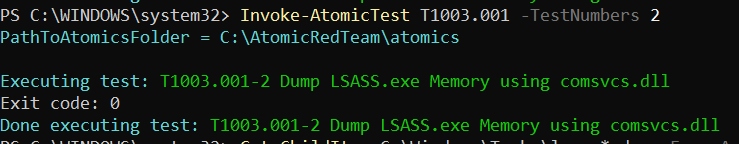
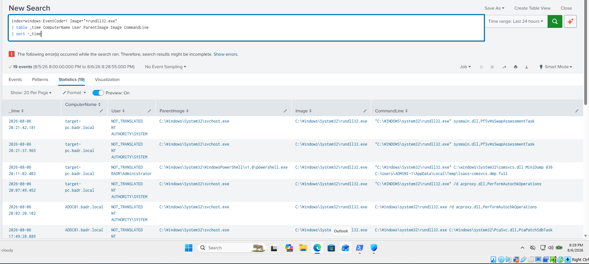
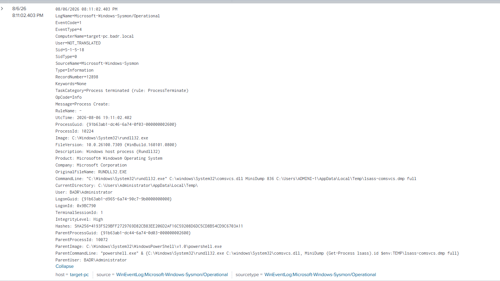
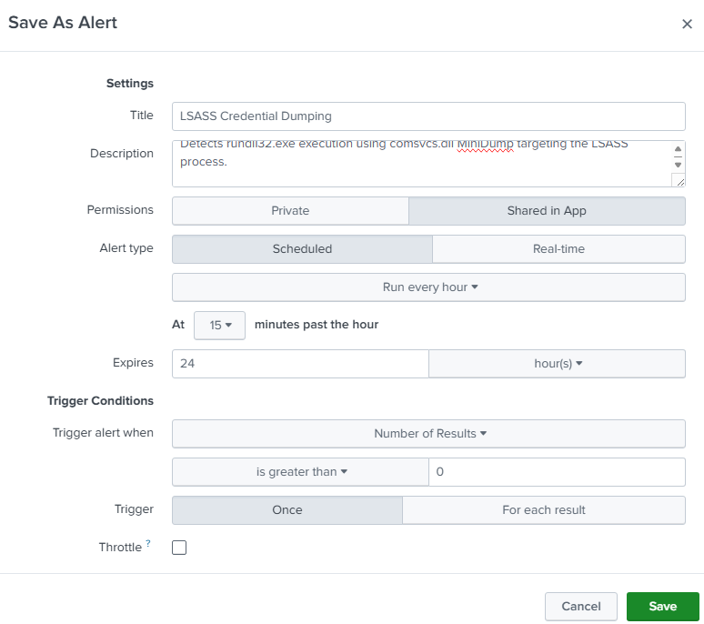
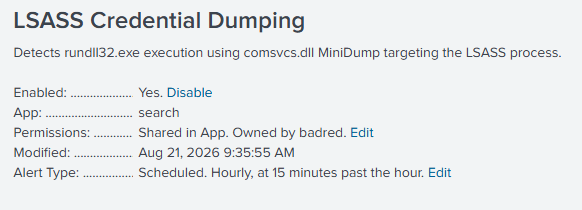

# UC-005 — LSASS Credential Dumping

## Objective

Detect LSASS memory dumping activity using Sysmon telemetry and Splunk SIEM.

---

## MITRE ATT&CK

| Tactic | Technique | ID |
|---------|-----------|----|
| Credential Access | OS Credential Dumping: LSASS Memory | T1003.001 |

Reference:
https://attack.mitre.org/techniques/T1003/001/

---

## Attack Description

An Atomic Red Team test (T1003.001-2) was executed in a controlled laboratory environment to simulate credential dumping from the LSASS process.

The attack used **rundll32.exe** together with **comsvcs.dll** to invoke the **MiniDump** function and create a memory dump of the LSASS process.

---

## Data Source

- Sysmon Event ID 1 (Process Creation)

---

## Detection Query

```spl
index=windows EventCode=1 Image="*rundll32.exe"
CommandLine="*comsvcs.dll*"
CommandLine="*MiniDump*"
CommandLine="*lsass*"
| table _time ComputerName User ParentImage Image CommandLine
```

---

## Detection Evidence

### Atomic Red Team Execution



---

### Splunk Detection



---

### Event Details



---

## Investigation

| Field | Value |
|--------|-------|
| Technique | T1003.001 |
| Event ID | 1 |
| Process | rundll32.exe |
| Parent Process | powershell.exe |
| DLL | comsvcs.dll |
| Function | MiniDump |
| Target Process | lsass.exe |
| Dump File | lsass-comsvcs.dmp |
| User | BADR\Administrator |
| Host | target-pc |

---

## Detection Logic

This detection is based on the behavior of LSASS memory dumping rather than the execution of **rundll32.exe** alone.

The rule correlates multiple indicators within the command line to identify credential dumping activity.

Detection Indicators:

- Process: rundll32.exe
- DLL: comsvcs.dll
- Function: MiniDump
- Target Process: lsass.exe

Using multiple indicators significantly reduces false positives because **rundll32.exe** is a legitimate Windows process that is frequently executed during normal system operation.

---

## 5 WHY Analysis

### Problem

Credential dumping activity targeting the LSASS process was detected.

### Why 1

Why was **rundll32.exe** executed?

Because it was used to invoke **comsvcs.dll**.

### Why 2

Why was **comsvcs.dll** used?

Because it exposes the **MiniDump** function capable of dumping process memory.

### Why 3

Why dump the LSASS process?

Because LSASS stores authentication material that may contain user credentials.

### Why 4

Why are credentials valuable?

Attackers can use them for privilege escalation and lateral movement.

### Why 5

Why should SOC analysts detect this behavior?

Credential dumping is one of the most common techniques used after initial access to compromise additional systems.

### Root Cause

A credential dumping technique attempted to access the memory of the LSASS process using **rundll32.exe** and **comsvcs.dll**.

---

## 5W1H Analysis

| Question | Analysis |
|---|---|
| **Who?** | `BADR\Administrator` |
| **What?** | `rundll32.exe` invoked `comsvcs.dll` with the `MiniDump` function to create a memory dump of the `lsass.exe` process. |
| **When?** | The activity occurred during the controlled UC-005 Atomic Red Team simulation and was captured by Sysmon Event ID 1. |
| **Where?** | The activity was executed on `target-pc`. |
| **Why?** | The activity was intentionally generated to simulate LSASS credential dumping and validate SOC detection capabilities. |
| **How?** | `rundll32.exe` was used with `comsvcs.dll` and its `MiniDump` functionality to target the LSASS process and generate a dump file. |

---

## Splunk Detection Rule

The validated SPL query was converted into a scheduled Splunk alert to automatically identify behavior associated with LSASS credential dumping through `comsvcs.dll`.

### Detection Query

```spl
index=windows EventCode=1 Image="*rundll32.exe"
CommandLine="*comsvcs.dll*"
CommandLine="*MiniDump*"
CommandLine="*lsass*"
| table _time ComputerName User ParentImage Image CommandLine
```

### Alert Configuration

| Setting | Value |
|---|---|
| Alert Name | `UC-005 - LSASS Credential Dumping` |
| Alert Type | Scheduled |
| Schedule | Hourly, at 15 minutes past the hour |
| Trigger Condition | Number of Results > 0 |
| Trigger Action | Log Event |
| Status | Enabled |

### Alert Evidence





The rule provides automated detection of a specific LSASS dumping technique using `rundll32.exe`, `comsvcs.dll`, and the `MiniDump` function.

---

## Containment

The detected activity was generated intentionally as part of the authorized SOC laboratory simulation. Therefore, no emergency containment was required.

However, LSASS credential dumping in a production environment should be treated as a high-priority security event.

If the activity were unauthorized, containment actions could include:

- Isolating the affected endpoint from the network.
- Restricting or disabling the potentially compromised account.
- Blocking identified malicious processes or artifacts.
- Preserving the LSASS dump and relevant telemetry as forensic evidence.
- Investigating authentication activity associated with the affected user and endpoint.

---

## Eradication

No malicious software was introduced during this controlled simulation. However, the generated LSASS memory dump represents a sensitive artifact and should be removed after evidence collection.

For a confirmed malicious incident, eradication could include:

- Removing unauthorized LSASS dump files.
- Removing malicious scripts, tools, or payloads responsible for credential dumping.
- Identifying and removing persistence mechanisms associated with the attacker.
- Searching other endpoints for similar credential dumping activity.
- Resetting credentials that may have been exposed.

---

## Recovery

After eradication, the affected system should be validated before returning to normal operation.

Recovery actions could include:

- Confirming that unauthorized dump files and malicious artifacts have been removed.
- Resetting potentially compromised credentials.
- Restoring affected accounts after validation.
- Confirming that endpoint security controls remain operational.
- Verifying that Sysmon and Splunk telemetry continue to function correctly.
- Monitoring the endpoint for repeated credential access attempts.

In this laboratory, the endpoint remained operational and the activity was confirmed as an authorized simulation.

---

## Post-Incident Activity

### Lessons Learned

- Access to LSASS memory is a high-risk behavior because authentication material may be exposed.
- `rundll32.exe` is a legitimate Windows binary, so detecting the executable alone would generate false positives.
- Detection becomes more reliable when multiple indicators such as `rundll32.exe`, `comsvcs.dll`, `MiniDump`, and `lsass.exe` are correlated.
- Sysmon Event ID 1 provides valuable command-line telemetry for identifying this technique.
- Credential dumping activity should be correlated with authentication and lateral movement events.

### Recommendations

- Monitor suspicious access to the LSASS process.
- Detect known LSASS dumping command-line patterns.
- Restrict unnecessary administrative privileges.
- Investigate unusual execution of `rundll32.exe` involving `comsvcs.dll`.
- Search for authentication anomalies following suspected credential dumping.
- Review other endpoints for similar indicators when malicious activity is confirmed.
- Periodically review and tune the Splunk detection rule.

---

## Final Incident Classification

| Field | Result |
|---|---|
| Detection | Successful |
| Investigation | Completed |
| MITRE ATT&CK | `T1003.001 - OS Credential Dumping: LSASS Memory` |
| Detection Rule | Enabled |
| Severity | High if unauthorized |
| Containment | Not required – controlled simulation |
| Eradication | Remove generated dump artifact after evidence collection |
| Recovery | Validate endpoint and monitoring after cleanup |
| Post-Incident Review | Completed |
| Final Classification | Benign / Authorized Lab Simulation |

The SOC investigation successfully identified behavior consistent with LSASS credential dumping through `rundll32.exe` and `comsvcs.dll`.

Although the activity was intentionally generated using Atomic Red Team in the controlled laboratory, the same behavior in a production environment would require immediate investigation because successful credential dumping could enable privilege escalation and lateral movement.

---

## Analyst Conclusion

Splunk successfully detected execution of **rundll32.exe** with command-line arguments associated with LSASS credential dumping.

The command line clearly showed execution of **comsvcs.dll** using the **MiniDump** function targeting **lsass.exe**.

During this laboratory, the activity was intentionally generated using Atomic Red Team to validate credential dumping detection.

In a production environment, this behavior should be considered highly suspicious and immediately investigated because it may indicate an attempt to steal user credentials.

---

## Detection Status

| Item | Status |
|------|--------|
| Attack Executed | ✅ |
| Sysmon Logged Event | ✅ |
| Splunk Detection | ✅ |
| Investigation Completed | ✅ |
| MITRE Mapping | ✅ |
| Detection Logic | ✅ |
| 5 WHY Analysis | ✅ |
