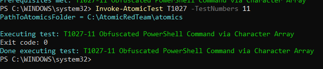
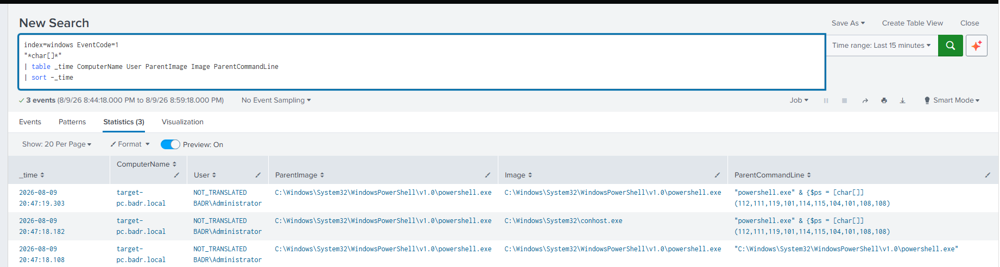
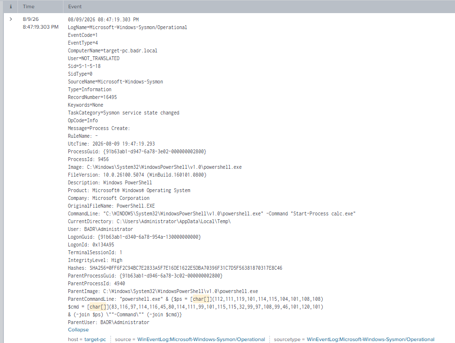
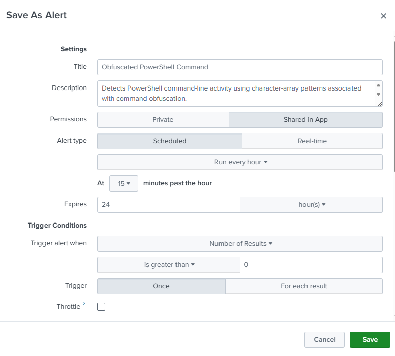
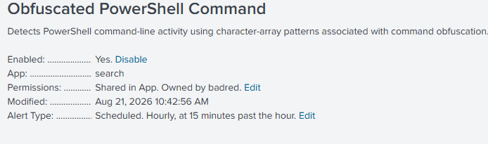

# UC-006 — Obfuscated PowerShell Command

## Objective

Detect obfuscated PowerShell execution using Sysmon telemetry and Splunk SIEM.

---

## MITRE ATT&CK

| Tactic | Technique | ID |
|---------|-----------|----|
| Defense Evasion | Obfuscated Files or Information | T1027 |

Reference:  
https://attack.mitre.org/techniques/T1027/

---

## Attack Description

An Atomic Red Team test (`T1027-11`) was executed in a controlled laboratory environment to simulate PowerShell command obfuscation.

The test represented a PowerShell command as a character array and reconstructed it at runtime using PowerShell operations such as `[char[]]` and `-join`.

The reconstructed command launched Windows Calculator (`calc.exe`).

---

## Data Source

- Sysmon Event ID 1 — Process Creation

---

## Detection Query

```spl
index=windows EventCode=1 "*char[]*"
| table _time ComputerName User ParentImage Image ParentCommandLine CommandLine
| sort -_time
```

---

## Detection Evidence

### Atomic Red Team Execution



The Atomic Red Team test completed successfully with exit code `0`.

---

### Splunk Detection



Splunk identified process creation events containing the character-array pattern used during the test.

---

### Event Details



---

## Investigation

| Field | Value |
|-------|-------|
| Technique | T1027 |
| Atomic Test | T1027-11 |
| Event ID | 1 |
| Process | powershell.exe |
| Parent Process | powershell.exe |
| Obfuscation Pattern | `[char[]]` and `-join` |
| Executed Command | `Start-Process calc.exe` |
| User | BADR\Administrator |
| Host | target-pc |
| Integrity Level | High |

---

## Detection Logic

The detection focuses on PowerShell command-line behavior associated with character-array obfuscation.

Detecting `powershell.exe` alone would generate many false positives because PowerShell is a legitimate administrative tool.

Instead, the detection searches for patterns such as:

- PowerShell execution
- Character-array construction using `[char[]]`
- Runtime string reconstruction using `-join`

These indicators can reveal attempts to hide the real command from simple command-line inspection.

---

## 5 WHY Analysis

### Problem

Obfuscated PowerShell activity was detected on the endpoint.

### Why 1

Why was the PowerShell command difficult to read?

Because parts of the command were represented using a character array.

### Why 2

Why were characters used instead of a normal command?

To reconstruct the actual command dynamically during execution.

### Why 3

Why would an attacker reconstruct a command dynamically?

To make the original command less obvious during inspection and potentially evade simple detection mechanisms.

### Why 4

Why is command obfuscation relevant to a SOC?

Because attackers can use obfuscation to conceal suspicious commands inside otherwise legitimate tools such as PowerShell.

### Why 5

Why should the SOC detect obfuscation patterns?

Because unusual command construction can provide an early indicator of defense evasion or malicious script execution.

### Root Cause

A PowerShell command was intentionally obfuscated using character-array construction and runtime string reconstruction.

---

## 5W1H Analysis

| Question | Analysis |
|---|---|
| **Who?** | `BADR\Administrator` |
| **What?** | An obfuscated PowerShell command was executed using character-array construction and runtime string reconstruction. |
| **When?** | The activity occurred during the controlled UC-006 Atomic Red Team simulation and was captured by Sysmon Event ID 1. |
| **Where?** | The activity was executed on `target-pc`. |
| **Why?** | The activity was intentionally generated to simulate command obfuscation and validate the SOC detection capability. |
| **How?** | PowerShell reconstructed the command dynamically using a character-array pattern and executed `Start-Process calc.exe`. |

---

## Splunk Detection Rule

The validated SPL query was converted into a scheduled Splunk alert to automatically identify PowerShell command-line activity containing character-array patterns associated with command obfuscation.

### Detection Query

```spl
index=windows EventCode=1 "*[char[]]*"
| table _time ComputerName User ParentImage Image ParentCommandLine CommandLine
| sort -_time
```

### Alert Configuration

| Setting | Value |
|---|---|
| Alert Name | `UC-006 - Obfuscated PowerShell Command` |
| Alert Type | Scheduled |
| Schedule | Hourly, at 15 minutes past the hour |
| Trigger Condition | Number of Results > 0 |
| Trigger Action | Log Event |
| Status | Enabled |

### Alert Evidence





The alert provides automated detection of the obfuscation pattern instead of requiring the SOC analyst to repeatedly perform manual searches.

---

## Containment

The activity was intentionally generated during an authorized laboratory simulation, therefore no containment action was required.

If similar activity were detected unexpectedly in a production environment, containment could include:

- Isolating the affected endpoint if additional malicious activity is identified.
- Restricting the affected user account if compromise is suspected.
- Terminating suspicious PowerShell processes when appropriate.
- Preserving PowerShell and Sysmon telemetry for further investigation.

---

## Eradication

No eradication was required in this laboratory because the reconstructed command only launched `calc.exe` and no malicious payload or persistence mechanism was introduced.

For confirmed malicious activity, eradication could include:

- Removing malicious PowerShell scripts or payloads.
- Removing persistence mechanisms created by the malicious command.
- Identifying and removing additional artifacts created during execution.
- Searching other endpoints for the same obfuscation pattern.
- Resetting compromised credentials when applicable.

---

## Recovery

No recovery action was required because the endpoint remained operational and uncompromised after the controlled simulation.

In a real incident, recovery could include:

- Confirming that malicious artifacts have been removed.
- Restoring affected accounts or services.
- Verifying that endpoint security controls remain operational.
- Confirming that Sysmon and Splunk telemetry continue to function.
- Monitoring the endpoint for repeated PowerShell or obfuscation activity.

---

## Post-Incident Activity

### Lessons Learned

- PowerShell is a legitimate administrative tool and its execution alone should not automatically be classified as malicious.
- Command obfuscation can make suspicious activity more difficult to identify through basic command-line inspection.
- Character-array construction and runtime string reconstruction can provide useful indicators of obfuscated PowerShell activity.
- Sysmon Event ID 1 provides command-line and parent-process telemetry useful for investigation.
- Detection should focus on suspicious behavior and execution patterns rather than only the presence of `powershell.exe`.

### Recommendations

- Monitor PowerShell command lines for common obfuscation patterns.
- Correlate suspicious PowerShell activity with parent and child processes.
- Investigate unusual processes launched by obfuscated PowerShell commands.
- Correlate PowerShell activity with network, file, Registry, and authentication telemetry.
- Establish a baseline of legitimate administrative PowerShell usage.
- Periodically review and tune the Splunk detection rule to reduce false positives.

---

## Final Incident Classification

| Field | Result |
|---|---|
| Detection | Successful |
| Investigation | Completed |
| MITRE ATT&CK | `T1027 - Obfuscated Files or Information` |
| Detection Rule | Enabled |
| Severity | Suspicious / Context-dependent |
| Containment | Not required – controlled simulation |
| Eradication | Not required – no malicious payload |
| Recovery | Not required – system unaffected |
| Post-Incident Review | Completed |
| Final Classification | Benign / Authorized Lab Simulation |

The SOC investigation successfully identified an obfuscated PowerShell command through Sysmon process creation telemetry.

The investigation showed that the command used character-array construction and runtime string reconstruction before launching `calc.exe`.

Although the activity was intentionally generated using Atomic Red Team in the controlled SOC laboratory, similar obfuscation observed unexpectedly in a production environment should be investigated because it may be used to conceal malicious command execution.

---

## Analyst Conclusion

Splunk successfully detected the obfuscated PowerShell activity through Sysmon Event ID 1.

The investigation showed a PowerShell parent command containing character-array and string reconstruction patterns, while the resulting PowerShell process executed `Start-Process calc.exe`.

During this laboratory, the activity was intentionally generated using Atomic Red Team to validate detection of command obfuscation.

In a production environment, this behavior should be investigated in context because PowerShell obfuscation may be used to conceal malicious commands and evade security monitoring.

---

## Detection Status

| Item | Status |
|------|--------|
| Attack Executed | ✅ |
| Sysmon Logged Event | ✅ |
| Splunk Detection | ✅ |
| Event Investigated | ✅ |
| MITRE Mapping | ✅ |
| Detection Logic | ✅ |
| 5 WHY Analysis | ✅ |
