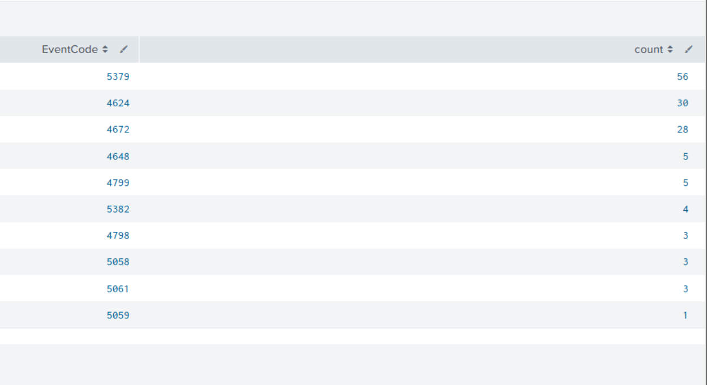

# UC-007 — RDP Lateral Movement Detection

## Objective

Detect and investigate Remote Desktop Protocol (RDP) activity between two Windows systems by correlating multiple Windows event sources in Splunk.

The objective is not to classify every successful RDP connection as malicious, but to determine whether the remote access is legitimate or potentially related to lateral movement.

---

## MITRE ATT&CK

| Tactic | Technique | ID |
|---|---|---|
| Lateral Movement | Remote Services: Remote Desktop Protocol | T1021.001 |

---

## Lab Scenario

An RDP connection was initiated from the Active Directory server toward the Windows 11 workstation.

| Role | Host | IP Address |
|---|---|---|
| Source | ADDC | 10.0.10.7 |
| Target | target-pc | 10.0.10.20 |
| Account | BADR\Administrator | — |

Two incorrect password attempts were performed before the successful authentication as part of the simulation.

However, the failed authentication attempts were not confirmed in the collected Security telemetry. Therefore, the investigation focuses only on the RDP connection, authentication, and session evidence that was successfully verified in Splunk.

---

## Data Sources

The investigation used multiple Windows event channels:

- `WinEventLog:Security`
- `Microsoft-Windows-RemoteDesktopServices-RdpCoreTS/Operational`
- `Microsoft-Windows-TerminalServices-RemoteConnectionManager/Operational`
- `Microsoft-Windows-TerminalServices-LocalSessionManager/Operational`

Using multiple data sources allows the analyst to correlate network connection, authentication, and session activity instead of relying on a single event.

---

## Initial Investigation

The investigation started with Windows Security logs on `target-pc`.

A broad search generated hundreds of events:

```spl
index=windows host="target-pc" earliest=-1h source="WinEventLog:Security"
```

Instead of manually reviewing every event, the Security events were grouped by `EventCode`:

```spl
index=windows host="target-pc" earliest=-1h source="WinEventLog:Security"
| stats count by EventCode
| sort -count
```

This reduced the amount of data and allowed authentication-related events to be identified more efficiently.

### Detection Evidence — Security EventCode Triage

> **Screenshot to use:** Splunk Statistics table showing EventCodes such as `5379`, `4624`, `4672`, `4648`, etc. with their event counts.



The Security investigation identified successful logon activity. However, the expected failed authentication events were not confirmed in the collected Security telemetry.

This demonstrated that relying only on the Security log was not sufficient to reconstruct the complete RDP activity.

---

## RDP Telemetry Investigation

The investigation was expanded to Windows Remote Desktop Services event channels.

This provided more specific telemetry related to the RDP connection.

---

## RDP Network Connection

### Event ID 131 — RdpCoreTS

The `Microsoft-Windows-RemoteDesktopServices-RdpCoreTS/Operational` channel recorded the incoming RDP network connection.

Event ID `131` showed that the server accepted a new connection from:

```text
10.0.10.7
```

This address corresponds to the ADDC server.

Example message:

```text
The server accepted a new TCP connection from client 10.0.10.7.
```

This event provides network-level evidence that the source system initiated communication with the Remote Desktop service on the target.

### Detection Evidence — Event 131

> **Screenshot to use:** screenshot showing `EventCode=131` with the message `The server accepted a new TCP connection from client 10.0.10.7`.


---

## RDP Authentication

### Event ID 1149 — RemoteConnectionManager

The `Microsoft-Windows-TerminalServices-RemoteConnectionManager/Operational` channel provided authentication evidence.

Event ID `1149` recorded a successful RDP authentication.

Observed information:

| Field | Value |
|---|---|
| User | Administrator |
| Domain | BADR |
| Source Network Address | 10.0.10.7 |
| Target | target-pc |
| Result | Authentication succeeded |

The event message confirmed:

```text
Remote Desktop Services: User authentication succeeded
```

This provided evidence that the account successfully authenticated to the Remote Desktop service from the ADDC server.

### Detection Evidence — Event 1149

> **Screenshot to use:** screenshot showing `EventCode=1149`, `User authentication succeeded`, User `Administrator`, Domain `BADR`, and Source Network Address `10.0.10.7`.


---

## RDP Session Creation

### Event ID 21 — LocalSessionManager

The `Microsoft-Windows-TerminalServices-LocalSessionManager/Operational` channel provided evidence that the authenticated user successfully obtained an RDP session.

Event ID `21` recorded:

```text
Remote Desktop Services: Session logon succeeded
```

Observed information:

| Field | Value |
|---|---|
| User | BADR\Administrator |
| Session ID | 2 |
| Source Network Address | 10.0.10.7 |
| Target | target-pc |

This event confirms that the authenticated account successfully established a Remote Desktop session.

### Detection Evidence — Event 21

> **Screenshot to use:** screenshot showing `EventCode=21`, `Session logon succeeded`, User `BADR\Administrator`, Session ID `2`, and Source Network Address `10.0.10.7`.


---

## RDP Shell Start

### Event ID 22 — LocalSessionManager

Event ID `22` provided additional evidence that the RDP session progressed beyond authentication and session creation.

The event recorded:

```text
Remote Desktop Services: Shell start notification received
```

This indicates that the Windows shell associated with the remote session was started.

### Detection Evidence — Event 22

> **Screenshot to use:** screenshot showing `EventCode=22` with `Remote Desktop Services: Shell start notification received`.


---

## Event Correlation

After identifying the relevant RDP telemetry, the events were investigated together using Splunk.

```spl
index=windows host="target-pc" earliest=-3h
(EventCode=131 OR EventCode=1149 OR EventCode=21 OR EventCode=22)
| table _time EventCode source User Source_Network_Address Message
| sort _time
```

The query brings together several stages of the RDP activity:

```text
RdpCoreTS Event 131
        |
        v
RemoteConnectionManager Event 1149
        |
        v
LocalSessionManager Event 21
        |
        v
LocalSessionManager Event 22
```

The events represent different stages of the remote connection:

| Event ID | Data Source | Meaning |
|---|---|---|
| 131 | RdpCoreTS | RDP network connection |
| 1149 | RemoteConnectionManager | RDP user authentication succeeded |
| 21 | LocalSessionManager | RDP session logon succeeded |
| 22 | LocalSessionManager | Remote session shell started |

### Detection Evidence — Correlation Search

> **Screenshot to use:** Splunk correlation table showing `_time`, `EventCode`, `source`, `User`, `Source_Network_Address`, and `Message`, including Event `131` and `1149` activity from `10.0.10.7`.


---

## Correlation Analysis

An important observation during the investigation was that not every Event ID `21` or `22` returned by the search belonged to the investigated RDP connection.

Some events showed:

```text
Source Network Address: LOCAL
```

and were associated with a different user/session.

These events should not be correlated with the ADDC-to-target-pc RDP activity.

Therefore, correlation must not rely only on Event IDs.

The analyst should correlate using multiple attributes:

- Timestamp
- Source IP address
- User account
- Target host
- Event source
- Session information
- Event message/context

For the investigated RDP activity, the primary remote source was:

```text
10.0.10.7
```

which corresponds to the ADDC server.

This demonstrates why contextual correlation is important in SOC investigations.

---

## Detection Logic

A successful RDP authentication alone should not automatically be classified as malicious.

RDP is commonly used by legitimate administrators and technicians.

The detection logic therefore focuses on identifying remote RDP activity and providing enough context for an analyst to determine whether the activity is expected.

The observed sequence can be represented as:

```text
Remote system initiates connection
              |
              v
RdpCoreTS Event 131
Remote TCP connection observed
              |
              v
RemoteConnectionManager Event 1149
User authentication succeeded
              |
              v
LocalSessionManager Event 21
RDP session logon succeeded
              |
              v
LocalSessionManager Event 22
Remote session shell started
```

The activity becomes more suspicious when additional contextual indicators are present, such as:

- Unexpected source host
- Unexpected administrative account
- Unusual source-to-destination relationship
- Remote access outside expected administrative activity
- Remote access from a workstation that normally does not administer other endpoints
- Suspicious activity occurring before or after the RDP session

---

## 5W1H Analysis

| Question | Finding |
|---|---|
| **Who?** | `BADR\Administrator` |
| **What?** | Successful RDP connection from ADDC to target-pc |
| **When?** | 16/08/2026 around 18:00:24 |
| **Where?** | Source: ADDC (`10.0.10.7`) → Target: target-pc (`10.0.10.20`) |
| **Why?** | The remote access was investigated to determine whether it represented legitimate administrative activity or potential lateral movement |
| **How?** | Remote Desktop Protocol (RDP) |

---

## Failed Authentication Observation

Two incorrect passwords were intentionally entered before the successful RDP authentication during the simulation.

However, the investigation did not confirm corresponding Event ID `4625` events in the Security telemetry collected by Splunk.

Because the failed authentication events were not verified, they are not used as detection evidence in this use case.

This represents an important SOC investigation principle:

> An analyst should distinguish between actions known to have occurred during a controlled simulation and actions that can actually be proven using collected telemetry.

The verified evidence in this investigation is therefore based on the successful RDP connection, authentication, and session activity.

---

## Analyst Conclusion

The investigation identified RDP activity originating from the ADDC server (`10.0.10.7`) and targeting the Windows 11 workstation (`10.0.10.20`).

Multiple Windows telemetry sources were required to reconstruct the activity.

RdpCoreTS provided network connection evidence, RemoteConnectionManager provided authentication evidence, and LocalSessionManager provided session-level evidence.

The correlation demonstrated the following sequence:

```text
ADDC (10.0.10.7)
        |
        | RDP
        v
target-pc (10.0.10.20)
        |
        +--> RDP connection observed
        |
        +--> Authentication succeeded
        |
        +--> RDP session established
        |
        +--> Remote shell started
```

Because the activity was intentionally generated in the lab, it represents a known simulation.

In a production SOC environment, the same successful RDP activity should not automatically be classified as an attack. The analyst must validate the user, source system, destination system, timing, and surrounding activity to determine whether the connection represents legitimate administration or potential lateral movement.

This use case demonstrates the importance of multi-source telemetry, event correlation, and contextual analysis when investigating Remote Desktop activity.

---

## Key Takeaways

- A single successful RDP event is not sufficient to classify activity as malicious.
- Different Windows event channels provide different stages of an RDP connection.
- Event ID `131` provides network connection evidence.
- Event ID `1149` provides successful RDP authentication evidence.
- Event ID `21` provides successful RDP session logon evidence.
- Event ID `22` provides remote shell/session evidence.
- Event correlation should include time, user, source IP, destination, and session context.
- Unrelated local events must not be incorrectly correlated with remote RDP activity.
- Detection conclusions must be based on telemetry that was actually observed and verified.
