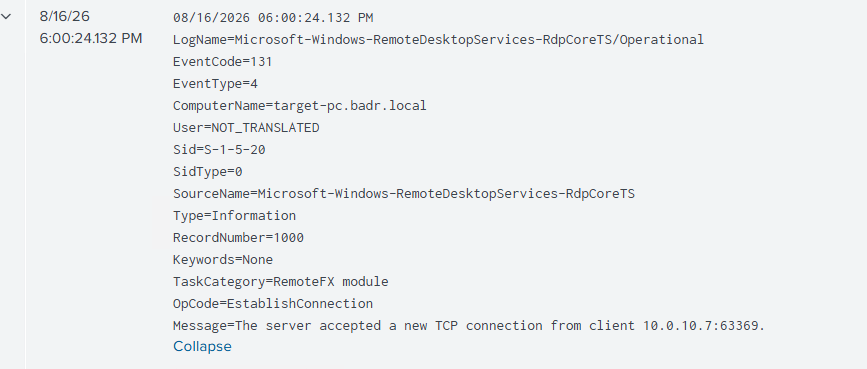
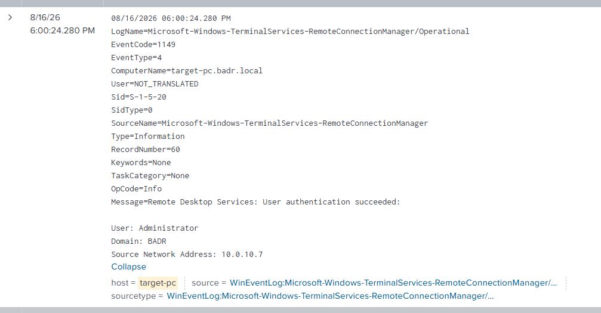
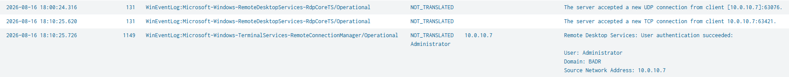

# UC-007 — RDP Lateral Movement Detection

## Objective

Detect and investigate Remote Desktop Protocol (RDP) activity between two Windows systems by correlating RDP network connection and authentication telemetry in Splunk.

The objective is not to classify every RDP connection as malicious. Instead, the analyst must identify the source, destination, user, time, and context of the remote access to determine whether it represents legitimate administrative activity or potential lateral movement.

---

## MITRE ATT&CK

| Tactic | Technique | ID |
|---|---|---|
| Lateral Movement | Remote Services: Remote Desktop Protocol | T1021.001 |

---

## Lab Scenario

An RDP connection was initiated from the Active Directory Domain Controller (ADDC) toward the Windows 11 workstation.

| Role | Host | IP Address |
|---|---|---|
| Source | ADDC | `10.0.10.7` |
| Target | target-pc | `10.0.10.20` |
| Account | `BADR\Administrator` | — |

Two incorrect passwords were intentionally entered before the correct credentials were used.

The failed authentication attempts were not confirmed in the telemetry collected by Splunk. Therefore, they are not used as detection evidence in this use case.

The investigation focuses only on events that were directly observed and verified in Splunk.

---

## Data Sources

The primary RDP telemetry used in this investigation came from two Windows event channels:

- `Microsoft-Windows-RemoteDesktopServices-RdpCoreTS/Operational`
- `Microsoft-Windows-TerminalServices-RemoteConnectionManager/Operational`

These sources provide two complementary types of evidence:

| Event ID | Data Source | Purpose |
|---|---|---|
| `131` | RdpCoreTS | Identifies the incoming RDP network connection |
| `1149` | RemoteConnectionManager | Identifies successful RDP user authentication |

Windows Security logs were also reviewed during the initial investigation, but they did not provide the expected failed authentication evidence for this specific lab scenario.

---

## Initial Investigation

The investigation initially started with the Windows Security logs on `target-pc`.

A broad Splunk search returned hundreds of events:

```spl
index=windows host="target-pc" earliest=-1h source="WinEventLog:Security"
```

Instead of manually reviewing every event, the events were grouped by EventCode:

```spl
index=windows host="target-pc" earliest=-1h source="WinEventLog:Security"
| stats count by EventCode
| sort -count
```

This reduced the volume of information and made it easier to identify the types of Security events generated during the investigation.

### Detection Evidence — Security EventCode Triage

> **Screenshot to use:** the Splunk Statistics table showing Security EventCodes such as `5379`, `4624`, `4672`, `4648`, and their respective counts.


The expected failed authentication Event ID `4625` was not observed in the collected Security telemetry.

Instead of assuming that no RDP activity occurred, the investigation pivoted to RDP-specific Windows event channels.

---

## RDP Network Connection Detection

The `Microsoft-Windows-RemoteDesktopServices-RdpCoreTS/Operational` channel provided network-level evidence of the RDP connection.

### Event ID 131 — Incoming RDP Connection

Event ID `131` recorded that `target-pc` accepted a connection from the ADDC server.

The observed message contained:

```text
The server accepted a new TCP connection from client 10.0.10.7.
```

The source address:

```text
10.0.10.7
```

corresponds to the ADDC server.

This event confirms that a remote connection from ADDC reached the Remote Desktop service on `target-pc`.

### Detection Evidence — Event ID 131

> **Screenshot to use:** the screenshot showing `EventCode=131` from `Microsoft-Windows-RemoteDesktopServices-RdpCoreTS/Operational`, with the message indicating that the server accepted a new TCP connection from client `10.0.10.7`.



---

## RDP Authentication Detection

After identifying the incoming connection, the investigation pivoted to:

```text
Microsoft-Windows-TerminalServices-RemoteConnectionManager/Operational
```

### Event ID 1149 — Successful RDP Authentication

Event ID `1149` recorded successful authentication to the Remote Desktop service.

The event contained the following information:

| Field | Value |
|---|---|
| Event ID | `1149` |
| User | `Administrator` |
| Domain | `BADR` |
| Source Network Address | `10.0.10.7` |
| Target Host | `target-pc` |
| Authentication Result | Successful |

The message recorded:

```text
Remote Desktop Services: User authentication succeeded
```

This provides authentication-level evidence that the `Administrator` account successfully authenticated from the ADDC server.

### Detection Evidence — Event ID 1149

> **Screenshot to use:** the screenshot showing `EventCode=1149`, the message `Remote Desktop Services: User authentication succeeded`, User `Administrator`, Domain `BADR`, and Source Network Address `10.0.10.7`.



---

## Event Correlation

A single event does not provide enough context to determine the complete activity.

The RDP connection was therefore investigated by correlating Event IDs `131` and `1149`.

The following Splunk query was used:

```spl
index=windows host="target-pc" earliest=-3h
(EventCode=131 OR EventCode=1149)
| table _time EventCode source User Source_Network_Address Message
| sort _time
```

The investigation identified the following sequence:

```text
ADDC — 10.0.10.7
        |
        | RDP connection
        v
+-----------------------------+
| Event ID 131                |
| RdpCoreTS                   |
| TCP connection accepted     |
| Source: 10.0.10.7           |
+-----------------------------+
        |
        v
+-----------------------------+
| Event ID 1149               |
| RemoteConnectionManager     |
| Authentication succeeded    |
| User: Administrator         |
| Domain: BADR                |
| Source: 10.0.10.7           |
+-----------------------------+
        |
        v
target-pc — 10.0.10.20
```

Both events point to the same source system:

```text
10.0.10.7
```

and occur within the same RDP connection context.

This provides stronger evidence than relying on either event independently.

### Detection Evidence — Event Correlation

> **Screenshot to use:** the Splunk table showing Event IDs `131` and `1149` close together in time. The screenshot should clearly show `_time`, `EventCode`, `source`, `User`, `Source_Network_Address`, and `Message`, with `10.0.10.7` visible.



---

## Detection Logic

The detection logic is based on correlating network-level RDP activity with successful RDP authentication.

The observed behavior can be represented as:

```text
Remote connection from an internal host
                |
                v
RdpCoreTS Event ID 131
Incoming RDP connection observed
                |
                v
RemoteConnectionManager Event ID 1149
RDP authentication succeeded
                |
                v
Correlate:
- Source IP
- User
- Target host
- Timestamp
                |
                v
Determine whether the activity is expected
```

The presence of Event ID `131` followed by Event ID `1149` confirms remote RDP connection and successful authentication activity.

However, this sequence alone does not prove malicious lateral movement.

RDP is commonly used for legitimate system administration.

The activity becomes more suspicious when additional contextual indicators are present, such as:

- An unexpected source system
- An unexpected administrative account
- An unusual source-to-destination relationship
- Remote access outside expected administrative activity
- RDP originating from a system that normally does not administer other endpoints
- Suspicious activity occurring before or after the RDP connection

Therefore, the detection identifies RDP activity requiring contextual validation rather than automatically classifying every successful RDP connection as an attack.

---

## 5W1H Analysis

| Question | Finding |
|---|---|
| **Who?** | `BADR\Administrator` |
| **What?** | Successful RDP connection and authentication from ADDC to target-pc |
| **When?** | 16/08/2026 around 18:00:24 |
| **Where?** | Source: ADDC (`10.0.10.7`) → Target: target-pc (`10.0.10.20`) |
| **Why?** | The remote activity was investigated to determine whether it represented legitimate administrative access or potential lateral movement |
| **How?** | Remote Desktop Protocol (RDP) |

---

## Failed Authentication Observation

During the controlled simulation, two incorrect passwords were intentionally entered before the correct credentials were used.

However, corresponding failed authentication events were not confirmed in the telemetry collected by Splunk.

In particular, the investigation did not identify Security Event ID `4625` corresponding to these failed RDP attempts.

Because this evidence was not observed, the failed attempts are not included in the detection chain.

This demonstrates an important SOC investigation principle:

> Actions performed during a controlled simulation must be distinguished from actions that can actually be demonstrated using collected telemetry.

The final investigation therefore relies only on verified evidence.

---

## Investigation Findings

The following activity was confirmed:

| Stage | Evidence | Finding |
|---|---|---|
| Network Connection | Event ID `131` | `target-pc` accepted an RDP-related connection from `10.0.10.7` |
| Authentication | Event ID `1149` | `Administrator` successfully authenticated from `10.0.10.7` |
| Correlation | Source IP + Time + Target | Both events were associated with the same RDP activity |

The correlation allowed the activity to be reconstructed without relying on assumptions or unrelated Windows events.

---

## Analyst Conclusion

The investigation identified Remote Desktop activity originating from the ADDC server (`10.0.10.7`) and targeting the Windows 11 workstation (`10.0.10.20`).

Two complementary Windows telemetry sources were used.

`RdpCoreTS` Event ID `131` provided evidence that the target accepted an incoming RDP connection from `10.0.10.7`.

`RemoteConnectionManager` Event ID `1149` provided evidence that the `Administrator` account successfully authenticated from the same source address.

The correlation therefore established the following verified sequence:

```text
ADDC (10.0.10.7)
        |
        | Remote connection
        v
RdpCoreTS — Event 131
        |
        | Successful authentication
        v
RemoteConnectionManager — Event 1149
        |
        v
target-pc (10.0.10.20)
```

Because this activity was intentionally generated as part of the SOC lab, it represents a known simulation.

In a production environment, the same RDP activity should not automatically be classified as malicious. A SOC analyst must validate the user, source system, destination system, time, and surrounding activity before determining whether the connection represents legitimate administration or potential lateral movement.

This use case demonstrates the importance of multi-source telemetry, event correlation, and contextual analysis when investigating remote access activity.

---

## Key Takeaways

- RDP activity should not be classified as malicious based on a single event.
- Event ID `131` can provide evidence of an incoming RDP network connection.
- Event ID `1149` can provide evidence of successful RDP authentication.
- Source IP, user, target host, and timestamp should be correlated during investigation.
- Legitimate administrative RDP activity and malicious lateral movement can produce similar telemetry.
- Context is required before assigning a malicious verdict.
- Unverified events should not be included as confirmed detection evidence.
- Missing expected telemetry can reveal visibility limitations in the monitoring environment.
