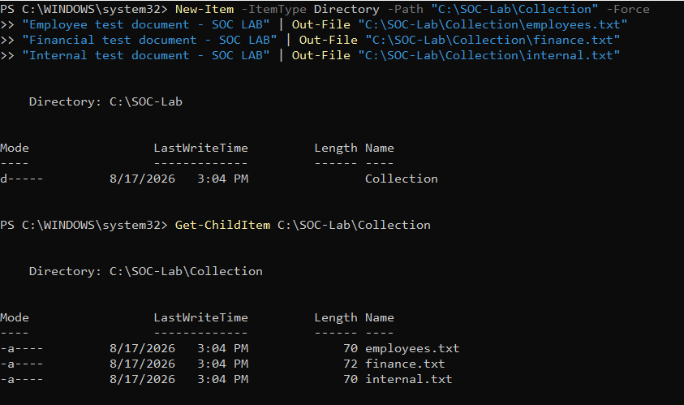
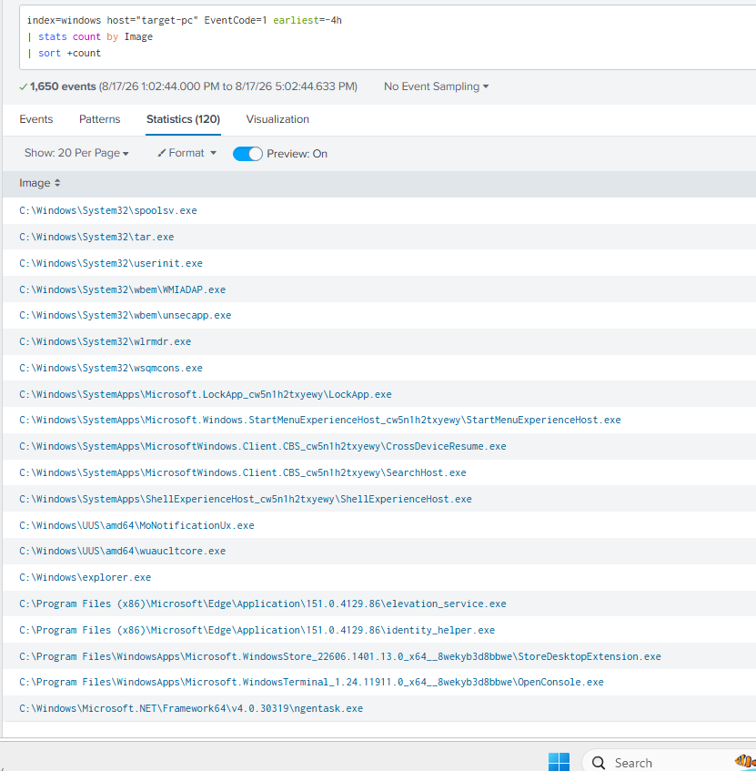
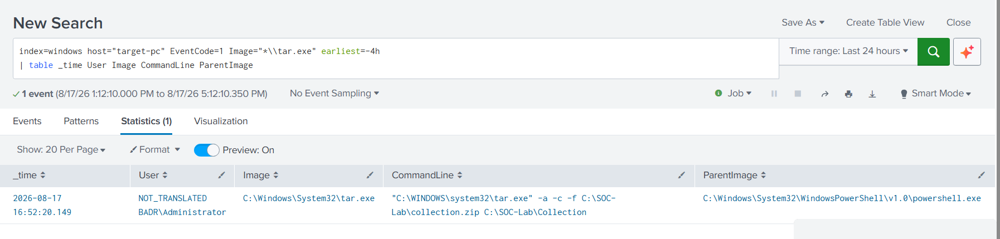
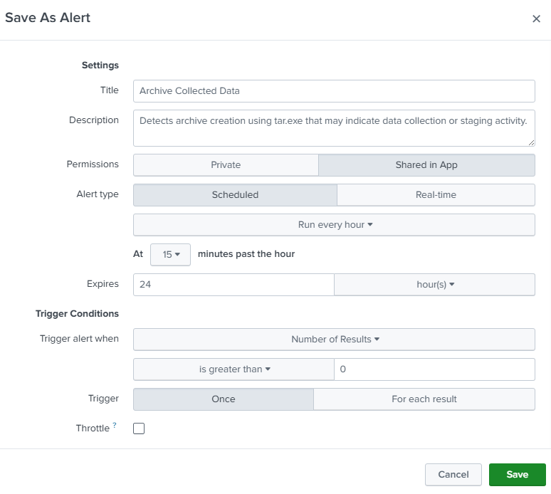
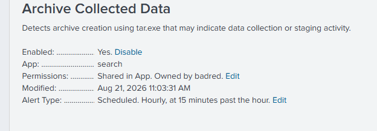

# UC-008 – Archive Collected Data

## Overview

This use case simulates the preparation of collected data for potential exfiltration by compressing multiple files into a single archive.

The activity maps to:

- **MITRE ATT&CK Technique:** T1560 – Archive Collected Data
- **Sub-technique:** T1560.001 – Archive via Utility
- **Target Host:** `target-pc`
- **Detection Source:** Sysmon
- **SIEM:** Splunk
- **Primary Event:** Sysmon Event ID 1 – Process Creation

The objective is to identify archive creation activity through process execution telemetry and command-line analysis.

---

## 1. Simulation Preparation

A dedicated directory was created on `target-pc` containing dummy files representing data that could potentially be collected by an attacker.

Directory:

```text
C:\SOC-Lab\Collection
```

The following test files were created:

```text
employees.txt
finance.txt
internal.txt
```

These files contain only dummy data created specifically for the isolated SOC lab.

### Evidence



---

## 2. Archive Simulation

The collected files were archived using the native Windows `tar.exe` utility.

The following command was executed:

```powershell
tar.exe -a -c -f C:\SOC-Lab\collection.zip C:\SOC-Lab\Collection
```

The command creates a ZIP archive named:

```text
C:\SOC-Lab\collection.zip
```

from the files located in:

```text
C:\SOC-Lab\Collection
```

Using a standalone archive utility generated process creation telemetry that could be observed through Sysmon and forwarded to Splunk.

---

## 3. Initial SOC Investigation

Instead of searching directly for `tar.exe`, the investigation started with a broader review of process creation activity on the target endpoint.

The following Splunk query was used:

```spl
index=windows host="target-pc" EventCode=1 earliest=-4h
| stats count by Image
| sort +count
```

The search returned approximately **1,650 process creation events** representing **120 unique process images**.

Reviewing the process distribution revealed the execution of:

```text
C:\Windows\System32\tar.exe
```

This provided a lead for further investigation.

### Evidence



---

## 4. Investigation of tar.exe

The investigation was then narrowed to Sysmon Process Creation events associated specifically with `tar.exe`.

The following Splunk query was used:

```spl
index=windows host="target-pc" EventCode=1 Image="*\\tar.exe" earliest=-4h
| table _time User Image CommandLine ParentImage
```

The search returned a single relevant process creation event.

The observed telemetry included:

```text
User:
BADR\Administrator

Image:
C:\Windows\System32\tar.exe

Parent Image:
C:\Windows\System32\WindowsPowerShell\v1.0\powershell.exe

Command Line:
"C:\WINDOWS\system32\tar.exe" -a -c -f C:\SOC-Lab\collection.zip C:\SOC-Lab\Collection
```

The command-line telemetry shows that `tar.exe` was launched from PowerShell and used to create `collection.zip` from the `C:\SOC-Lab\Collection` directory.

### Evidence



---

## 5. Detection Logic

The activity can be identified by monitoring process creation events for archive utilities and analyzing their command-line arguments.

An example Splunk detection query is:

```spl
index=windows EventCode=1
(
    Image="*\\tar.exe"
    OR Image="*\\7z.exe"
    OR Image="*\\rar.exe"
)
| table _time host User Image ParentImage CommandLine
| sort -_time
```

The execution of an archive utility alone should not automatically be considered malicious.

Additional context such as the user, parent process, command line, execution time, source files, and surrounding activity should be investigated before determining whether the behavior is suspicious.

---

## 6. SOC Analysis – 5W1H

After identifying the suspicious archive utility execution, the event was analyzed using the 5W1H methodology.

### Who?

The activity was executed by:

```text
BADR\Administrator
```

This identifies the user account responsible for launching the archive utility.

### What?

The Windows native utility `tar.exe` was executed to compress the contents of the collection directory into a ZIP archive.

```text
C:\SOC-Lab\Collection
        ↓
C:\SOC-Lab\collection.zip
```

The observed command line was:

```text
"C:\WINDOWS\system32\tar.exe" -a -c -f C:\SOC-Lab\collection.zip C:\SOC-Lab\Collection
```

### When?

The activity was observed in Splunk at approximately:

```text
2026-08-17 16:52:20
```

The timestamp provided by Sysmon allows the analyst to establish the timeline and correlate this activity with other events occurring around the same period.

### Where?

The activity occurred on:

```text
Host: target-pc
```

The source data was located in:

```text
C:\SOC-Lab\Collection
```

and the resulting archive was created as:

```text
C:\SOC-Lab\collection.zip
```

### Why?

The observed behavior is consistent with data staging or preparation for potential exfiltration.

Compressing multiple collected files into a single archive can make data easier to transfer from a compromised endpoint.

However, archive utilities such as `tar.exe` are legitimate administrative tools. Therefore, this event alone does not prove malicious activity and must be evaluated in context.

### How?

The activity was performed using the native Windows archive utility:

```text
C:\Windows\System32\tar.exe
```

The process was launched from:

```text
C:\Windows\System32\WindowsPowerShell\v1.0\powershell.exe
```

Sysmon Event ID 1 captured the process execution and its command-line arguments, which were then forwarded to Splunk for investigation.

---

## 7. Analyst Interpretation

The execution of `tar.exe` is not inherently malicious because archive utilities are commonly used for legitimate administrative and user activities.

The event became relevant during the investigation because several pieces of context were observed together:

- `tar.exe` was executed from PowerShell.
- Multiple files from the collection directory were targeted.
- The command created a single ZIP archive.
- The complete operation was visible in the process command line.
- The behavior corresponds to archive preparation activity described by MITRE ATT&CK T1560.001.

Therefore, the detection should be treated as **suspicious behavior requiring contextual investigation**, rather than automatically classified as malicious.

---

## 8. Investigation Summary

The investigation followed a progressive narrowing approach.

```text
1,650 Process Creation Events
        ↓
120 Unique Process Images
        ↓
tar.exe identified
        ↓
Sysmon Event ID 1 investigated
        ↓
User + Parent Process + Command Line analyzed
        ↓
Archive creation behavior identified
        ↓
Mapped to MITRE ATT&CK T1560.001
```

This approach demonstrates that a SOC analyst does not need to manually inspect every raw event.

Instead, the analyst reduces the dataset using relevant fields and behavioral context until the activity requiring investigation becomes visible.

---

## 9. Detection Result

The activity was successfully detected through Sysmon process creation telemetry and investigated in Splunk.

The final event provided the following evidence:

| Field | Observed Value |
|---|---|
| Host | `target-pc` |
| User | `BADR\Administrator` |
| Process | `C:\Windows\System32\tar.exe` |
| Parent Process | `powershell.exe` |
| Source Directory | `C:\SOC-Lab\Collection` |
| Archive | `C:\SOC-Lab\collection.zip` |
| Sysmon Event ID | `1` |
| MITRE ATT&CK | `T1560.001 – Archive via Utility` |

The most important evidence was the command line because it revealed not only that `tar.exe` executed, but also **what data was targeted and where the resulting archive was created**.

---

## 10. Key Learning

This use case demonstrated an important SOC principle:

> The execution of a legitimate tool does not automatically indicate malicious activity. Detection requires context.

The process name provided an initial lead, while the user, parent process, command line, target directory, and surrounding activity provided the context necessary to understand the behavior.

It also demonstrated the importance of telemetry visibility: an action occurring on an endpoint can only be investigated from the SIEM when the appropriate data source captures and forwards the relevant evidence.

---

## 11. Detection Result

The archive activity was successfully captured by Sysmon and forwarded to Splunk.

Sysmon Event ID 1 provided the necessary telemetry to identify:

- The archive utility used: `tar.exe`
- The account executing the process: `BADR\Administrator`
- The parent process: `powershell.exe`
- The complete command line
- The archive destination: `C:\SOC-Lab\collection.zip`
- The source directory: `C:\SOC-Lab\Collection`
- The execution timestamp

The investigation demonstrated how broad process telemetry can be progressively narrowed until the relevant archive activity is identified.

---

## 7. MITRE ATT&CK Mapping

| Field | Value |
|---|---|
| Tactic | Collection |
| Technique | Archive Collected Data |
| Technique ID | T1560 |
| Sub-technique | Archive via Utility |
| Sub-technique ID | T1560.001 |
| Data Source | Process Creation |
| Detection Source | Sysmon Event ID 1 |
| SIEM | Splunk |
| Host | `target-pc` |

---

---

## Splunk Detection Rule

The validated SPL query was converted into a scheduled Splunk alert to automatically identify archive creation using the native Windows `tar.exe` utility.

### Detection Query

```spl
index=windows host="target-pc" EventCode=1 Image="*\\tar.exe"
CommandLine="*.zip*"
| table _time ComputerName User ParentImage Image CommandLine
| sort -_time
```

The detection focuses on process creation telemetry where `tar.exe` is used to create or manipulate ZIP archives.

Because `tar.exe` is a legitimate Windows utility, detection of the process alone does not prove malicious activity. The command line, user, parent process, archive destination, source directory, and surrounding activity must be investigated before assigning a malicious verdict.

### Alert Configuration

| Setting | Value |
|---|---|
| Alert Name | `UC-008 - Archive Collected Data` |
| Alert Type | Scheduled |
| Schedule | Hourly, at 15 minutes past the hour |
| Trigger Condition | Number of Results > 0 |
| Trigger Action | Log Event |
| Status | Enabled |

### Alert Evidence





The alert provides automated visibility into archive creation activity that could represent data collection or staging before exfiltration.

---

## Containment

The archive creation observed during UC-008 was intentionally generated as part of the authorized SOC laboratory. Therefore, no emergency containment was required.

If similar activity were confirmed as suspicious in a production environment, containment actions could include:

- Isolating the affected endpoint if additional malicious behavior is identified.
- Restricting the affected account if compromise is suspected.
- Preventing suspicious archive files from being transferred outside the environment.
- Preserving the archive and associated telemetry for forensic investigation.
- Investigating processes executed before and after the archive creation.

---

## Eradication

No malicious software or persistence mechanism was introduced during this controlled simulation.

The generated test archive can be removed after the required evidence has been preserved.

For confirmed malicious activity, eradication could include:

- Removing unauthorized archive files.
- Removing malicious scripts or tools responsible for data collection.
- Identifying and removing persistence mechanisms associated with the attacker.
- Searching other endpoints for similar archive creation behavior.
- Removing additional staged data discovered during the investigation.

---

## Recovery

No significant recovery action was required because the endpoint remained operational and uncompromised during the laboratory simulation.

In a real incident, recovery could include:

- Confirming that unauthorized archives and malicious artifacts have been removed.
- Verifying that sensitive data is no longer staged for transfer.
- Restoring affected accounts or services when necessary.
- Confirming that Sysmon and Splunk telemetry remain operational.
- Monitoring the endpoint for repeated collection, archive creation, or exfiltration activity.

---

## Post-Incident Activity

### Lessons Learned

- Archive utilities such as `tar.exe` are legitimate tools and should not automatically be classified as malicious.
- Command-line arguments provide important context for distinguishing normal archive operations from suspicious data staging.
- Parent process, user account, source directory, archive destination, and timestamp should be reviewed during investigation.
- Sysmon Event ID 1 provides useful process creation telemetry for identifying archive creation.
- Archive creation can represent a preparation stage before data exfiltration.
- Detection rules should focus on behavior and context rather than only executable names.

### Recommendations

- Monitor archive creation involving unusual directories or sensitive data.
- Investigate unexpected archive creation by privileged accounts.
- Correlate archive creation with previous collection activity.
- Correlate archive creation with subsequent network connections or file transfers.
- Establish a baseline of legitimate archive operations.
- Review and tune the Splunk detection rule to reduce false positives.

---

## Final Incident Classification

| Field | Result |
|---|---|
| Detection | Successful |
| Investigation | Completed |
| MITRE ATT&CK | `T1560.001 - Archive Collected Data: Archive via Utility` |
| Detection Rule | Enabled |
| Process | `tar.exe` |
| Source Directory | `C:\SOC-Lab\Collection` |
| Archive | `C:\SOC-Lab\collection.zip` |
| Containment | Not required – controlled simulation |
| Eradication | Test archive may be removed after evidence collection |
| Recovery | Not required – system unaffected |
| Post-Incident Review | Completed |
| Final Classification | Benign / Authorized Lab Simulation |

The SOC investigation successfully identified archive creation activity through Sysmon process creation telemetry and Splunk.

The command-line evidence showed that `tar.exe` was used to archive the contents of `C:\SOC-Lab\Collection` into `C:\SOC-Lab\collection.zip`.

Although the activity was intentionally generated during the controlled SOC laboratory, similar archive creation in a production environment should be correlated with collection and network activity because it may represent data staging before exfiltration.

---

## Conclusion

UC-008 successfully demonstrated the detection and investigation of archive creation activity on the Windows 11 endpoint.

The investigation started from a broad set of process creation events and progressively narrowed the results until the relevant `tar.exe` execution was identified.

The final Sysmon Event ID 1 provided the process, user, parent process, command-line, and timestamp context required to investigate the activity in Splunk.

The observed behavior is consistent with **MITRE ATT&CK T1560.001 – Archive via Utility** and demonstrates how archive creation can be detected as part of data collection and staging activity.
