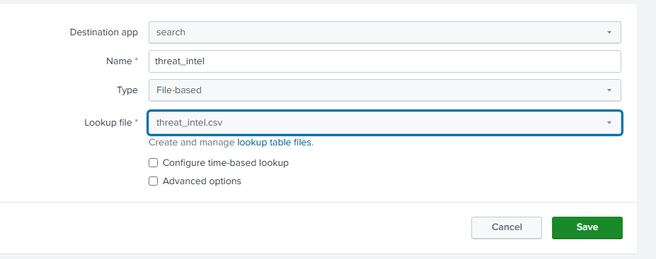
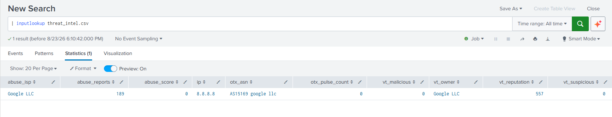
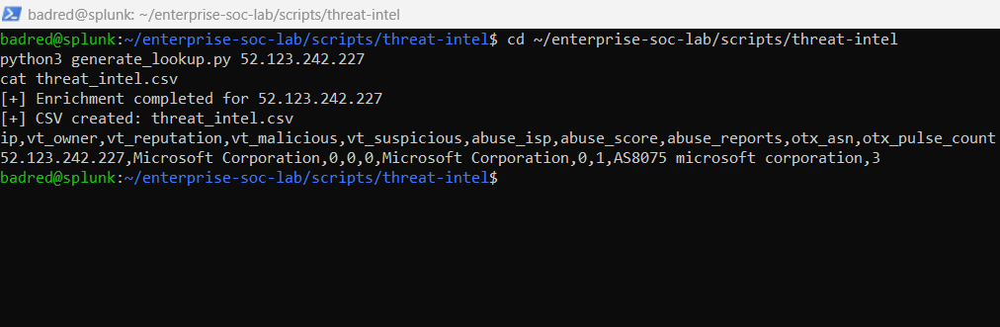
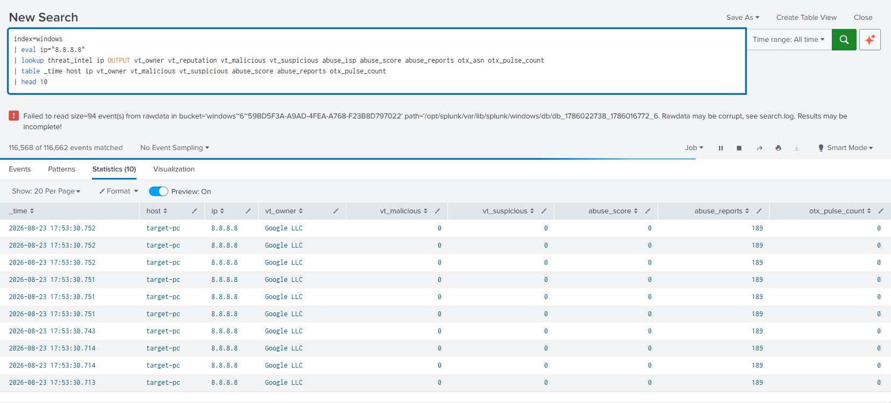
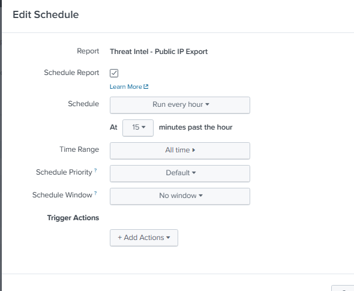
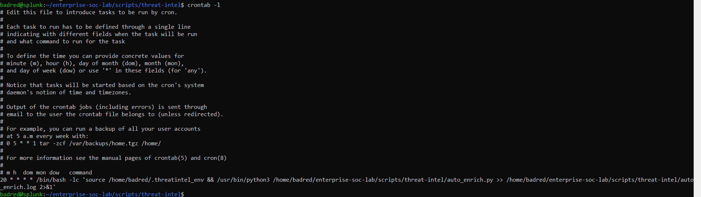
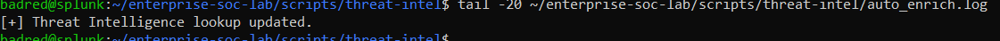

# Threat Intelligence Integration and Automated IP Enrichment

## 1. Overview

This component extends the SOC laboratory by adding **Threat Intelligence enrichment** to network telemetry collected by Splunk.

Before implementing Threat Intelligence, Splunk could identify network connections generated by monitored Windows endpoints through **Sysmon Event ID 3 (Network Connection)**.

For example, an event could contain:

```text
Source Host: ADDC01
Process: MpDefenderCoreService.exe
Destination IP: 52.123.242.227
Destination Port: 443
```

Although this information shows that a connection occurred, the destination IP alone provides limited context to a SOC analyst.

The purpose of the Threat Intelligence component is therefore to answer additional questions such as:

- Who owns the destination IP?
- Has the IP been reported for malicious activity?
- What reputation information is available?
- How many abuse reports exist for the IP?
- Is the IP associated with known threat intelligence campaigns?
- Should the connection receive additional investigation?

To provide this context, three Threat Intelligence providers were integrated:

- **VirusTotal**
- **AbuseIPDB**
- **AlienVault OTX**

The enrichment results are stored in a CSV lookup and correlated with network events inside Splunk.

---

# 2. Why Threat Intelligence Was Added

A SIEM can collect large quantities of telemetry, but raw telemetry does not always provide enough information for an analyst to understand the security relevance of an event.

For example:

```text
DestinationIp = 52.123.242.227
```

does not immediately tell the analyst whether the IP belongs to a legitimate cloud provider, a suspicious infrastructure provider, or a known malicious system.

Threat Intelligence adds external context to the event.

After enrichment, the analyst may see information similar to:

```text
Destination IP : 52.123.242.227
Owner          : Microsoft Corporation
VT Reputation  : 0
VT Malicious   : 0
Abuse Score    : 0
Abuse Reports  : 1
OTX ASN        : AS8075 Microsoft Corporation
OTX Pulses     : 3
```

The original network event has not changed.

Instead, additional external intelligence has been associated with the IP address.

This process is known as **enrichment**.

---

# 3. Architecture

The implemented workflow is:

```text
Windows Endpoint
      |
      | Sysmon Event ID 3
      v
Splunk Universal Forwarder
      |
      v
Splunk SIEM
      |
      | Scheduled Search (:15 every hour)
      v
public_ips.csv
      |
      v
auto_enrich.py (:20 every hour)
      |
      +----------------------+
      |          |           |
      v          v           v
 VirusTotal   AbuseIPDB   AlienVault OTX
      |          |           |
      +----------+-----------+
                 |
                 v
         threat_intel.csv
                 |
                 v
          Splunk Lookup
                 |
                 v
Network Event + Threat Intelligence Context
```

Two automation mechanisms are therefore used:

1. **Splunk Scheduled Report**
   - extracts public destination IP addresses observed in network telemetry.

2. **Linux Cron Job**
   - periodically enriches those IP addresses using the Threat Intelligence APIs.

This separates telemetry collection from Threat Intelligence processing.

---

# 4. Threat Intelligence Providers

Using multiple Threat Intelligence providers provides more context than relying on a single source.

Each provider contributes different information.

## 4.1 VirusTotal

VirusTotal is used to obtain reputation information about an IP address.

The integration retrieves fields such as:

```text
Owner
Reputation
Malicious detections
Suspicious detections
Harmless detections
```

Example:

```text
IP Address : 8.8.8.8
Owner      : Google LLC
Reputation : 557
Malicious  : 0
Suspicious : 0
Harmless   : 53
```

VirusTotal is particularly useful for understanding how different security engines classify an indicator.

---

## 4.2 AbuseIPDB

AbuseIPDB provides information based primarily on reports of abusive Internet activity.

The integration retrieves:

```text
ISP
Domain
Country
Usage Type
Abuse Confidence Score
Total Reports
```

Example:

```text
IP Address    : 8.8.8.8
ISP           : Google LLC
Domain        : google.com
Abuse Score   : 0
Total Reports : 188
```

The **Abuse Confidence Score** helps provide context about whether an IP has been associated with abusive behavior.

A report count alone should not automatically classify an IP as malicious. The complete context must still be investigated.

---

## 4.3 AlienVault OTX

AlienVault Open Threat Exchange (OTX) provides community-driven Threat Intelligence.

The integration retrieves information including:

```text
Country
ASN
Pulse Count
Threat Pulses
```

Example:

```text
IP Address  : 8.8.8.8
Country     : US
ASN         : AS15169 Google LLC
Pulse Count : 0
```

An OTX **Pulse** represents a collection of threat indicators associated with security research, campaigns, malware, or other threat intelligence.

---

# 5. Why Multiple Providers Were Used

No single Threat Intelligence provider provides complete security context.

The three providers complement each other:

| Provider | Main Contribution |
|---|---|
| VirusTotal | Reputation and security-engine analysis |
| AbuseIPDB | Abuse reports and abuse confidence |
| AlienVault OTX | Community threat intelligence and threat pulses |

Using several providers allows the analyst to compare multiple independent sources before reaching a conclusion.

This is important because Threat Intelligence should provide **context**, not automatically determine whether an event is malicious.

---

# 6. Individual API Integration

Before integrating Threat Intelligence with Splunk, each API was tested independently.

This approach was used to verify that:

- the API key was valid;
- network connectivity worked;
- the API returned the expected data;
- the Python parsing logic worked correctly.

The following scripts were created:

```text
scripts/threat-intel/
├── virustotal_lookup.py
├── abuseipdb_lookup.py
└── otx_lookup.py
```

Each script accepts an IP address and queries one Threat Intelligence provider.

Example:

```bash
python3 virustotal_lookup.py 8.8.8.8
```

This testing method made it possible to validate each component separately before combining the three services.

---

# 7. Unified IP Enrichment

After validating the individual APIs, a unified enrichment script was created:

```text
scripts/threat-intel/enrich_ip.py
```

Instead of manually querying three different services, the script accepts one IP address and queries:

```text
VirusTotal
     +
AbuseIPDB
     +
AlienVault OTX
```

The results are then presented together.

Example:

```bash
python3 enrich_ip.py 8.8.8.8
```

Example output:

```text
========== Unified IP Enrichment ==========

IP Address: 8.8.8.8

--- VirusTotal ---
Owner: Google LLC
Reputation: 557
Malicious: 0
Suspicious: 0

--- AbuseIPDB ---
ISP: Google LLC
Domain: google.com
Abuse Score: 0
Total Reports: 188

--- AlienVault OTX ---
Country: US
ASN: AS15169 Google LLC
Pulse Count: 0
```

This confirmed that the three Threat Intelligence sources could be combined successfully.

---

# 8. CSV-Based Splunk Integration

Several integration methods can be used to connect external Threat Intelligence with a SIEM.

For this laboratory, a **CSV lookup architecture** was selected.

The enrichment information is stored in:

```text
threat_intel.csv
```

The CSV contains fields similar to:

```text
ip
vt_owner
vt_reputation
vt_malicious
vt_suspicious
abuse_isp
abuse_score
abuse_reports
otx_asn
otx_pulse_count
```

Example:

```csv
ip,vt_owner,vt_reputation,vt_malicious,vt_suspicious,abuse_isp,abuse_score,abuse_reports,otx_asn,otx_pulse_count
52.123.242.227,Microsoft Corporation,0,0,0,Microsoft Corporation,0,1,AS8075 microsoft corporation,3
```

The CSV approach was selected because it is:

- simple to implement;
- compatible with Splunk lookups;
- easy to inspect and troubleshoot;
- suitable for the scale of the laboratory;
- independent from continuous live API requests during every Splunk search.

---

# 9. Splunk Lookup Configuration

The generated CSV was added to the Splunk Search application as a lookup file:

```text
threat_intel.csv
```

A lookup definition named:

```text
threat_intel
```

was then created.

The lookup can be tested using:

```spl
| inputlookup threat_intel.csv
```

This confirms that Splunk can read the Threat Intelligence information.

---

# 10. Correlating Threat Intelligence with Splunk Events

The next step was to correlate the Threat Intelligence lookup with real network telemetry.

Sysmon Event ID 3 provides network connection information including:

```text
Image
DestinationIp
DestinationPort
```

A Splunk lookup can associate `DestinationIp` with the `ip` field stored in the Threat Intelligence lookup.

Example:

```spl
index=windows EventCode=3
| where isnotnull(DestinationIp)
| lookup threat_intel ip AS DestinationIp OUTPUT
    vt_owner
    vt_reputation
    vt_malicious
    vt_suspicious
    abuse_isp
    abuse_score
    abuse_reports
    otx_asn
    otx_pulse_count
| table _time host Image DestinationIp DestinationPort
    vt_owner vt_reputation vt_malicious vt_suspicious
    abuse_score abuse_reports otx_asn otx_pulse_count
```

This changes the analyst view from raw network telemetry into enriched telemetry.

---

# 11. Real Event Validation

The integration was validated using a real public IP observed in the collected Sysmon network telemetry:

```text
52.123.242.227
```

The address appeared in Sysmon Event ID 3 network events.

The associated process was:

```text
MpDefenderCoreService.exe
```

and the connection used:

```text
Destination Port: 443
```

Threat Intelligence enrichment returned information including:

```text
Owner          : Microsoft Corporation
VT Malicious   : 0
VT Suspicious  : 0
Abuse Score    : 0
Abuse Reports  : 1
OTX ASN        : AS8075 Microsoft Corporation
OTX Pulse Count: 3
```

Splunk successfully correlated the original network event with the Threat Intelligence lookup.

This provided end-to-end validation of:

```text
Sysmon Network Event
        ↓
Destination IP
        ↓
Threat Intelligence Lookup
        ↓
Enriched Splunk Event
```

The result also demonstrates an important SOC principle:

> The presence of an IP in a Threat Intelligence source does not automatically mean that the observed connection is malicious.

The process, destination, reputation, timing, user, host, and surrounding telemetry must all be considered.

---

# 12. Public IP Extraction

Enriching every observed IP address would be unnecessary.

Private addresses such as:

```text
10.0.10.7
10.0.10.20
```

represent internal laboratory systems and are not useful candidates for Internet Threat Intelligence services.

A Splunk search was therefore created to extract public destination IP addresses from Sysmon Event ID 3 telemetry.

```spl
index=windows EventCode=3
| where isnotnull(DestinationIp)
| where NOT cidrmatch("10.0.0.0/8", DestinationIp)
AND NOT cidrmatch("172.16.0.0/12", DestinationIp)
AND NOT cidrmatch("192.168.0.0/16", DestinationIp)
AND NOT cidrmatch("127.0.0.0/8", DestinationIp)
AND NOT cidrmatch("169.254.0.0/16", DestinationIp)
AND NOT cidrmatch("224.0.0.0/4", DestinationIp)
| where NOT like(DestinationIp,"%:%")
| stats count by DestinationIp
| rename DestinationIp AS ip
| outputlookup public_ips.csv
```

This search removes internal and other non-relevant address ranges and creates:

```text
public_ips.csv
```

The file represents the list of public IPv4 destinations observed by Splunk.

---

# 13. Automated Public IP Collection

Manually executing the public IP search would not provide a sustainable SOC workflow.

The search was therefore saved as a Splunk scheduled report:

```text
Threat Intel - Public IP Export
```

Description:

```text
Exports public destination IPs from Windows network events to public_ips.csv for automated threat intelligence enrichment.
```

The report runs:

```text
Every hour at :15
```

Each execution refreshes:

```text
public_ips.csv
```

Therefore, newly observed public destination addresses can automatically become candidates for Threat Intelligence enrichment.

No Splunk trigger action is required because the SPL search itself performs the output operation using:

```spl
| outputlookup public_ips.csv
```

---

# 14. Automated Enrichment Script

Manual enrichment is useful for investigation, but it does not scale well when multiple public IP addresses are observed.

For this reason, an automated enrichment script was created:

```text
scripts/threat-intel/auto_enrich.py
```

The script performs the following workflow:

```text
Read public_ips.csv
        ↓
Identify public IP addresses
        ↓
Check existing enrichment data
        ↓
Query VirusTotal
        ↓
Query AbuseIPDB
        ↓
Query AlienVault OTX
        ↓
Combine results
        ↓
Update threat_intel.csv
```

Previously enriched addresses can be retained so that unnecessary API requests are reduced.

This is particularly useful when using free API plans that may have request limits.

Successful execution was validated when the script processed multiple observed public IP addresses and finished with:

```text
[+] Threat Intelligence lookup updated.
```

---

# 15. API Key Security

API credentials must not be stored directly inside the GitHub repository.

For this reason, the API keys were stored locally on the Ubuntu Splunk server in:

```text
~/.threatintel_env
```

The file contains environment variables used by the Python scripts.

The file permissions were restricted using:

```bash
chmod 600 ~/.threatintel_env
```

This means the credentials remain on the server and are not committed to the public project repository.

The scripts access the keys through environment variables such as:

```text
VT_API_KEY
ABUSEIPDB_API_KEY
OTX_API_KEY
```

The presence of the variables was validated without displaying the actual secret values.

This approach prevents API credentials from appearing in:

- GitHub source code;
- screenshots;
- documentation;
- Splunk searches.

---

# 16. Cron Automation

The Splunk scheduled report automatically creates the public IP list.

A second automation mechanism is required to run the Python enrichment process.

A Linux cron job was configured:

```cron
20 * * * * /bin/bash -lc 'source /home/badred/.threatintel_env && /usr/bin/python3 /home/badred/enterprise-soc-lab/scripts/threat-intel/auto_enrich.py >> /home/badred/enterprise-soc-lab/scripts/threat-intel/auto_enrich.log 2>&1'
```

The cron job runs:

```text
Every hour at :20
```

The five-minute delay is intentional.

The complete schedule is:

```text
HH:15
Splunk extracts observed public IPs
        ↓
public_ips.csv updated

HH:20
Python enrichment starts
        ↓
VT + AbuseIPDB + OTX queried
        ↓
threat_intel.csv updated
```

This ensures that the Python script runs after Splunk has refreshed the public IP list.

---

# 17. Automation Logging

The output of the automated enrichment process is redirected to:

```text
auto_enrich.log
```

This provides basic operational visibility into the automation.

The log can be reviewed using:

```bash
tail -20 ~/enterprise-soc-lab/scripts/threat-intel/auto_enrich.log
```

A successful execution ends with:

```text
[+] Threat Intelligence lookup updated.
```

Logging is important because automated processes should provide evidence that they executed successfully and allow troubleshooting if enrichment fails.

---

# 18. Complete Automated Workflow

After implementation, the Threat Intelligence pipeline operates as follows:

### Step 1 — Network Activity

A Windows endpoint communicates with an external IP address.

### Step 2 — Endpoint Telemetry

Sysmon records the connection as:

```text
Event ID 3 — Network Connection
```

### Step 3 — Log Forwarding

Splunk Universal Forwarder sends the telemetry to the Splunk server.

### Step 4 — SIEM Collection

Splunk indexes the network event in:

```text
index=windows
```

### Step 5 — Public IP Extraction

At minute `:15`, the scheduled Splunk report identifies public destination IP addresses.

The results are written to:

```text
public_ips.csv
```

### Step 6 — Threat Intelligence Enrichment

At minute `:20`, the Ubuntu cron job launches:

```text
auto_enrich.py
```

### Step 7 — External Intelligence

The script queries:

```text
VirusTotal
AbuseIPDB
AlienVault OTX
```

### Step 8 — Lookup Update

The combined results are written to:

```text
threat_intel.csv
```

### Step 9 — SIEM Correlation

Splunk uses the lookup to correlate the destination IP with its Threat Intelligence context.

### Step 10 — SOC Investigation

The analyst can investigate the network event using both:

```text
Internal telemetry
+
External Threat Intelligence
```

This provides significantly more context than investigating the IP address alone.

---

# 19. Manual vs Automated Enrichment

Two enrichment approaches remain available.

## Manual Investigation

For a specific IP:

```bash
python3 enrich_ip.py <IP_ADDRESS>
```

This is useful when a SOC analyst wants to investigate one indicator immediately.

## Automated Enrichment

```text
Splunk Scheduled Report
        +
auto_enrich.py
        +
Cron
```

This continuously maintains a Threat Intelligence lookup based on IP addresses observed in the environment.

The manual script is therefore useful for **ad-hoc investigation**, while the automated workflow provides **continuous enrichment**.

---

# 20. Project Files

The final Threat Intelligence scripts are:

```text
scripts/threat-intel/
├── README.md
├── virustotal_lookup.py
├── abuseipdb_lookup.py
├── otx_lookup.py
├── enrich_ip.py
└── auto_enrich.py
```

### `virustotal_lookup.py`

Tests and retrieves IP reputation information from VirusTotal.

### `abuseipdb_lookup.py`

Retrieves abuse reputation and reporting information from AbuseIPDB.

### `otx_lookup.py`

Retrieves AlienVault OTX intelligence such as ASN and threat pulse information.

### `enrich_ip.py`

Combines the three providers for manual investigation of a single IP address.

### `auto_enrich.py`

Processes the public IP list generated by Splunk and maintains the automated Threat Intelligence lookup.

---

# 21. Detection and Investigation Value

The Threat Intelligence integration does not replace detection logic.

Instead, it improves investigation by providing additional context.

For example, an analyst investigating:

```text
powershell.exe
        ↓
DestinationIp = X.X.X.X
```

can correlate the destination with:

```text
VirusTotal detections
AbuseIPDB reputation
OTX threat intelligence
```

A suspicious process communicating with a poorly reputed IP would generally deserve more attention than a known legitimate system communicating with trusted infrastructure.

However, the final verdict should always consider multiple pieces of evidence.

---

# 22. Limitations

The implementation has several limitations.

### API Rate Limits

The laboratory uses external Threat Intelligence APIs that may impose request limits, particularly on free accounts.

### IP-Based Enrichment

The current automated pipeline focuses on IPv4 destination addresses.

It does not currently automate enrichment for:

- domains;
- URLs;
- file hashes;
- email indicators.

The architecture could be extended later to support additional indicator types.

### Threat Intelligence Is Contextual

A positive report or OTX pulse does not automatically prove malicious activity.

Likewise, an IP with no detections is not guaranteed to be safe.

Threat Intelligence results must be correlated with endpoint and network telemetry.

### CSV Lookup Architecture

CSV lookups are appropriate for this laboratory, but a larger production SOC may use:

- dedicated Threat Intelligence platforms;
- Splunk KV Store;
- commercial Threat Intelligence integrations;
- SOAR workflows;
- dedicated enrichment services.

---

# 23. Detection Evidence

The following screenshots document the Threat Intelligence implementation and provide evidence of the complete enrichment workflow.

## 23.1 Splunk Lookup Definition



This screenshot shows the Splunk lookup definition associated with `threat_intel.csv`.  
The lookup allows enrichment data generated by the Python automation to be accessed directly from Splunk searches.

---

## 23.2 Splunk Lookup Results



The `threat_intel.csv` lookup was tested inside Splunk to confirm that the enrichment fields were successfully imported and could be queried by the SIEM.

---

## 23.3 Public IP Enrichment



A public IP observed in the Windows network telemetry was manually enriched using the Threat Intelligence providers.

This test confirmed that VirusTotal, AbuseIPDB, and AlienVault OTX could successfully return intelligence for an IP observed in the SOC environment.

---

## 23.4 Threat Intelligence Event Correlation



This screenshot demonstrates the correlation between a real Sysmon Event ID 3 network connection and the Threat Intelligence lookup.

The original event provides fields such as:

```text
Host
Process Image
Destination IP
Destination Port
```

The lookup adds external intelligence such as:

```text
VirusTotal owner and reputation
VirusTotal malicious/suspicious detections
AbuseIPDB score and reports
AlienVault OTX ASN and pulse count
```

This confirms that Threat Intelligence context can be displayed directly alongside endpoint network telemetry during a SOC investigation.

---

## 23.5 Automated Public IP Export



The public IP extraction search was saved as the scheduled Splunk report:

```text
Threat Intel - Public IP Export
```

The report executes every hour at minute `:15` and updates `public_ips.csv` with public destination IP addresses observed in Windows Sysmon network events.

This removes the need to manually collect IP addresses before enrichment.

---

## 23.6 Cron Automation



A Linux cron job was configured on the Splunk Ubuntu server to execute the automated enrichment script every hour at minute `:20`.

The five-minute delay allows the Splunk scheduled report to update `public_ips.csv` before the enrichment process begins.

The resulting workflow is:

```text
:15 → Splunk exports public IP addresses
                    ↓
             public_ips.csv
                    ↓
:20 → Python enrichment starts
                    ↓
     VirusTotal + AbuseIPDB + OTX
                    ↓
             threat_intel.csv
```

---

## 23.7 Automation Execution Log



The automation log confirms that the Python enrichment process executed successfully.

The final message:

```text
[+] Threat Intelligence lookup updated.
```

confirms that the observed public IP addresses were processed and the Splunk Threat Intelligence lookup was updated.

---

## Evidence Summary

The collected evidence validates the complete Threat Intelligence pipeline:

```text
Sysmon Event ID 3
        ↓
Splunk Network Telemetry
        ↓
Public IP Extraction
        ↓
Scheduled Splunk Report
        ↓
public_ips.csv
        ↓
Automated Python Enrichment
        ↓
VirusTotal + AbuseIPDB + AlienVault OTX
        ↓
threat_intel.csv
        ↓
Splunk Lookup
        ↓
Enriched SOC Investigation
```

Together, these screenshots demonstrate both the implementation and the successful operation of the automated Threat Intelligence enrichment workflow.

---

# 24. Security Considerations

The following security practices were applied:

- API keys were not hard-coded in Python scripts.
- API keys were not committed to GitHub.
- API keys were stored as environment variables.
- The environment file was protected with restrictive permissions.
- Screenshots do not expose secret API values.
- Internal/private IP addresses are filtered before external enrichment.
- Threat Intelligence results are treated as contextual evidence rather than automatic malicious verdicts.

---

# 25. Result

The Threat Intelligence phase successfully implemented an automated enrichment pipeline connecting:

```text
Sysmon
   ↓
Splunk
   ↓
Public IP Extraction
   ↓
Python Automation
   ↓
VirusTotal + AbuseIPDB + AlienVault OTX
   ↓
Splunk Threat Intelligence Lookup
   ↓
SOC Investigation
```

The system can identify public destination IP addresses observed in Windows network telemetry, enrich them using multiple external intelligence providers, maintain the enrichment information in a Splunk lookup, and make that context available during SIEM investigations.

This transforms raw network telemetry into more useful security information while maintaining the principle that **Threat Intelligence supports analyst decision-making rather than replacing contextual investigation**.
