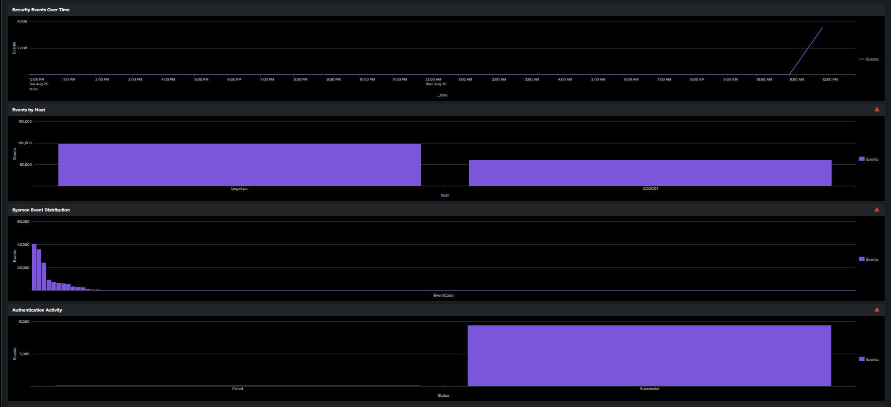
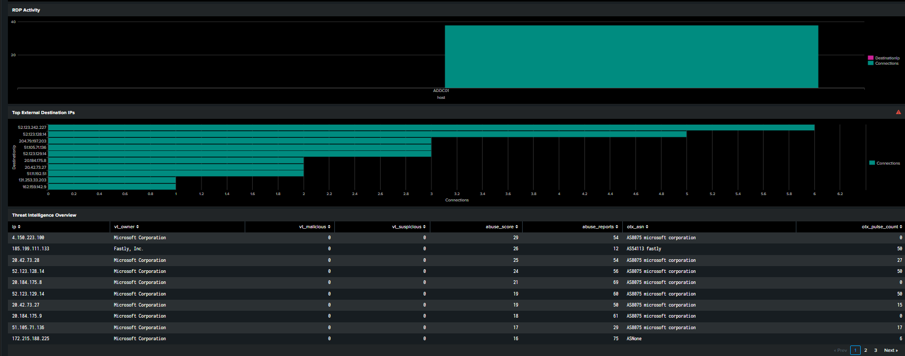
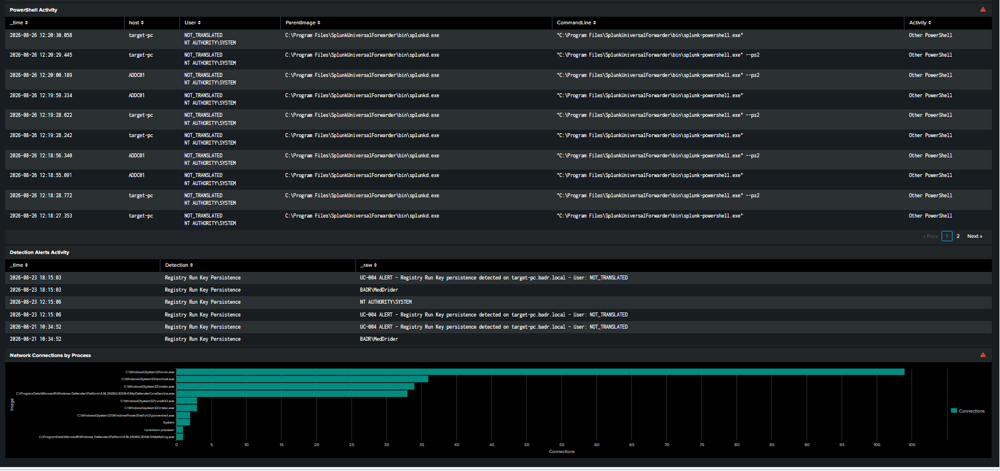

# SOC Security Overview Dashboard

## 1. Overview

The **SOC Security Overview** dashboard provides a centralized monitoring interface for the Enterprise SOC Lab.

Instead of requiring a SOC analyst to manually execute multiple SPL searches during every investigation, the dashboard consolidates the most important security telemetry into a single operational view.

The dashboard combines:

- Windows endpoint telemetry
- Sysmon events
- Authentication activity
- RDP activity
- Network connections
- PowerShell execution
- Detection alerts
- External destination IP monitoring
- Threat Intelligence enrichment

The objective is to reproduce a simplified SOC monitoring workflow where endpoint activity can be detected, investigated, and enriched from a central SIEM interface.

---

## 2. Dashboard Objectives

The dashboard was designed to provide the analyst with visibility across the main security activities generated during the SOC lab.

The main objectives are:

1. Monitor the overall volume of security telemetry.
2. Compare event activity between monitored endpoints.
3. Understand the distribution of Sysmon events.
4. Monitor successful and failed authentication attempts.
5. Identify RDP network activity.
6. Identify frequently contacted external IP addresses.
7. Provide Threat Intelligence context for observed public IP addresses.
8. Monitor PowerShell process execution.
9. Display persisted Splunk detection alerts.
10. Identify processes generating network connections.

The dashboard therefore acts as the central monitoring layer between raw telemetry and SOC investigation.

---

## 3. Data Sources

The dashboard uses telemetry collected from the monitored Windows systems in the lab.

### Monitored Systems

| System | Role |
|---|---|
| Windows 11 (`target-pc`) | Primary endpoint / attack simulation target |
| Windows Active Directory (`ADDC01`) | Domain Controller and authentication infrastructure |
| Ubuntu Server | Splunk SIEM and Threat Intelligence automation server |

Windows telemetry is collected using **Sysmon** and Windows Event Logs.

The Splunk Universal Forwarder installed on the Windows systems forwards the collected events to the central Splunk server.

### Main Telemetry Flow

```text
Windows 11 / Active Directory
             |
             v
     Sysmon + Windows Logs
             |
             v
 Splunk Universal Forwarder
             |
             v
         Splunk SIEM
             |
             v
   SOC Security Overview
```

This architecture allows endpoint events to be centralized and analyzed from the Splunk interface.

---

## 4. Threat Intelligence Data Flow

The dashboard also consumes the Threat Intelligence lookup created during the Threat Intelligence implementation phase.

Public destination IP addresses observed in Sysmon Event ID 3 network telemetry are periodically extracted from Splunk.

These addresses are enriched using three independent Threat Intelligence providers:

- VirusTotal
- AbuseIPDB
- AlienVault OTX

The resulting workflow is:

```text
Sysmon Event ID 3
        |
        v
Public Destination IP
        |
        v
Splunk Scheduled Export
        |
        v
public_ips.csv
        |
        v
auto_enrich.py
        |
        +----------------+
        |       |        |
        v       v        v
 VirusTotal  AbuseIPDB   OTX
        |       |        |
        +-------+--------+
                |
                v
        threat_intel.csv
                |
                v
          Splunk Lookup
                |
                v
Threat Intelligence Overview
```

The Threat Intelligence panel therefore provides additional context for IP addresses observed in endpoint network telemetry.

---

# 5. Time Range Strategy

Different panels use different time ranges depending on their operational objective.

Two main strategies are used.

## 5.1 Last 24 Hours

The **Security Events Over Time** panel uses the last 24 hours.

This panel is intended to represent an operational monitoring view. A SOC analyst is primarily interested in recent activity when looking for unusual increases or decreases in telemetry.

Using a recent time window also prevents historical laboratory activity from dominating the visualization.

## 5.2 All Time

Most other panels use **All time**.

The project is a controlled SOC laboratory where attack simulations and detection tests were performed at different moments.

Using the complete available dataset allows the dashboard to preserve evidence from all completed simulations and makes it possible to compare historical activity across the laboratory.

In a production SOC, these panels would normally use shorter operational windows such as the last 24 hours, 7 days, or another period appropriate to the monitoring requirement.

## 5.3 Threat Intelligence Lookup

The Threat Intelligence panel reads directly from `threat_intel.csv` using `inputlookup`.

Therefore, the traditional Splunk event time range is not significant for this panel.

The panel represents the current content of the Threat Intelligence lookup.

---

# 6. Dashboard Panels

## 6.1 Security Events Over Time

### Purpose

This panel provides a chronological view of the volume of Windows security telemetry received by Splunk.

It can help identify:

- sudden increases in endpoint activity;
- periods containing attack simulations;
- abnormal event spikes;
- telemetry interruptions;
- changes in endpoint activity.

### SPL Query

```spl
index=windows
| timechart span=1h count AS Events
```

### Time Range

```text
Last 24 hours
```

### SOC Value

A sudden increase in the number of events does not automatically indicate malicious activity, but it provides an initial signal that an analyst can investigate using the other dashboard panels.

---

## 6.2 Events by Host

### Purpose

This panel compares the volume of events generated by each monitored Windows system.

### SPL Query

```spl
index=windows
| stats count AS Events by host
| sort - Events
```

### Time Range

```text
All time
```

### SOC Value

The panel allows the analyst to quickly determine which endpoint is generating the largest amount of telemetry.

It can also help identify situations where an expected endpoint stops sending events.

In the current laboratory, the primary monitored systems are `target-pc` and `ADDC01`.

---

## 6.3 Sysmon Event Distribution

### Purpose

This panel displays the distribution of Sysmon event types collected during the laboratory.

### SPL Query

```spl
index=windows
| where isnotnull(EventCode)
| stats count AS Events by EventCode
| sort - Events
```

### Time Range

```text
All time
```

### SOC Value

Sysmon generates different Event IDs depending on endpoint activity.

Important examples used throughout the laboratory include:

| Event ID | Meaning |
|---|---|
| 1 | Process Creation |
| 3 | Network Connection |
| 7 | Image Loaded |
| 11 | File Creation |
| 13 | Registry Value Set |
| 22 | DNS Query |

The distribution helps the analyst understand which categories of endpoint activity dominate the collected telemetry.

---

## 6.4 Authentication Activity

### Purpose

This panel compares successful and failed Windows authentication events.

### SPL Query

```spl
index=windows source="WinEventLog:Security" (EventCode=4624 OR EventCode=4625)
| eval Status=case(
    EventCode=4624,"Successful",
    EventCode=4625,"Failed"
)
| stats count AS Events by Status
```

### Time Range

```text
All time
```

### Relevant Windows Events

```text
4624 = Successful Logon
4625 = Failed Logon
```

### SOC Value

Authentication monitoring is important for detecting behavior such as:

- repeated failed login attempts;
- suspicious successful logons;
- brute-force patterns;
- unauthorized remote authentication.

The laboratory dataset contains both successful and failed authentication activity.

---

## 6.5 RDP Activity

### Purpose

This panel identifies network connections associated with Remote Desktop Protocol.

### SPL Query

```spl
index=windows EventCode=3 DestinationPort=3389
| stats count AS Connections by host DestinationIp
| sort - Connections
```

### Time Range

```text
All time
```

### SOC Value

RDP uses TCP port `3389`.

Monitoring this activity can help identify remote access and possible lateral movement behavior.

This panel complements the RDP detection and investigation performed during the SOC use cases.

---

## 6.6 Top External Destination IPs

### Purpose

This panel identifies the most frequently contacted public destination IP addresses observed in Sysmon network events.

### SPL Query

```spl
index=windows EventCode=3
| where isnotnull(DestinationIp)
| where NOT cidrmatch("10.0.0.0/8", DestinationIp)
    AND NOT cidrmatch("172.16.0.0/12", DestinationIp)
    AND NOT cidrmatch("192.168.0.0/16", DestinationIp)
    AND NOT cidrmatch("127.0.0.0/8", DestinationIp)
    AND NOT cidrmatch("169.254.0.0/16", DestinationIp)
    AND NOT cidrmatch("224.0.0.0/4", DestinationIp)
| where NOT like(DestinationIp,"%:%")
| stats count AS Connections by DestinationIp
| sort - Connections
| head 10
```

### Time Range

```text
All time
```

### Why Private Addresses Are Removed

Internal, loopback, link-local, multicast, and IPv6 addresses are excluded because the objective of this panel is to identify public IPv4 destinations that can be investigated using external Threat Intelligence services.

### SOC Value

An analyst can use this panel to identify external infrastructure contacted by monitored endpoints and prioritize IP addresses for reputation analysis.

---

## 6.7 Threat Intelligence Overview

### Purpose

This panel displays the automatically generated Threat Intelligence dataset.

### SPL Query

```spl
| inputlookup threat_intel.csv
| table ip vt_owner vt_malicious vt_suspicious abuse_score abuse_reports otx_asn otx_pulse_count
| sort - abuse_score - vt_malicious - otx_pulse_count
```

### Data Sources

The following enrichment providers are used:

**VirusTotal**

Provides information such as:

- network owner;
- reputation;
- malicious detections;
- suspicious detections.

**AbuseIPDB**

Provides information such as:

- ISP;
- abuse confidence score;
- number of abuse reports.

**AlienVault OTX**

Provides information such as:

- ASN;
- threat pulse count.

### SOC Value

An IP address alone provides limited context.

Threat Intelligence enrichment allows the analyst to determine whether external infrastructure has suspicious reputation indicators or has previously appeared in threat intelligence datasets.

Using several providers also provides broader context than relying on a single external source.

---

## 6.8 PowerShell Activity

### Purpose

This panel displays PowerShell process execution observed by Sysmon.

### SPL Query

```spl
index=windows EventCode=1 Image="*powershell.exe"
| eval Activity=case(
    like(CommandLine,"%EncodedCommand%") OR like(CommandLine,"%-enc%"),"Encoded PowerShell",
    like(CommandLine,"%Bypass%"),"ExecutionPolicy Bypass",
    like(CommandLine,"%[char[]]%"),"Obfuscated PowerShell",
    1=1,"Other PowerShell"
)
| table _time host User ParentImage CommandLine Activity
| sort -_time
| head 20
```

### Time Range

```text
All time
```

### SOC Value

PowerShell is a legitimate Windows administration tool but can also be abused by attackers.

The dashboard exposes information such as:

- endpoint;
- user;
- parent process;
- command line;
- classified PowerShell activity.

This panel complements the PowerShell-related detection use cases implemented in the project.

---

## 6.9 Detection Alerts Activity

### Purpose

This panel displays Splunk alert events that were persisted using the alert **Log Event** action.

### SPL Query

```spl
index=main source="alert:*"
| eval Detection=replace(source,"^alert:","")
| table _time Detection _raw
| sort -_time
| head 30
```

### Time Range

```text
All time
```

### Current Laboratory Evidence

During validation, persisted alert events were confirmed for:

```text
Registry Run Key Persistence
```

The events are stored using a source similar to:

```text
alert:Registry Run Key Persistence
```

The current evidence should not be interpreted as meaning that every detection rule in the laboratory generates a persisted `index=main` log event.

Instead, this panel provides visibility into detection alerts for which the Log Event action is configured and available in the Splunk dataset.

### SOC Value

This allows an analyst to view detection activity alongside endpoint and network telemetry without manually searching for individual alert-generated events.

---

## 6.10 Network Connections by Process

### Purpose

This panel identifies the processes responsible for the largest number of network connections.

### SPL Query

```spl
index=windows EventCode=3
| where isnotnull(Image)
| stats count AS Connections by Image
| sort - Connections
| head 10
```

### Time Range

```text
All time
```

### SOC Value

This provides process-level network visibility.

Instead of seeing only the destination IP address, the analyst can identify which executable initiated the connection.

Examples observed in the laboratory include Windows system processes, RDP components, Microsoft Defender processes, and PowerShell-related processes.

Unexpected network activity from an unusual executable can provide an investigation lead.

---

# 7. Dashboard Evidence

The following screenshots demonstrate the completed dashboard.

## 7.1 Endpoint and Authentication Monitoring



This section of the dashboard contains:

- Security Events Over Time
- Events by Host
- Sysmon Event Distribution
- Authentication Activity

It provides a high-level view of endpoint telemetry and authentication behavior.

---

## 7.2 Network and Threat Intelligence Monitoring



This section contains:

- RDP Activity
- Top External Destination IPs
- Threat Intelligence Overview

It connects endpoint network telemetry with external reputation information collected through the automated Threat Intelligence pipeline.

---

## 7.3 PowerShell, Detection, and Process Monitoring



This section contains:

- PowerShell Activity
- Detection Alerts Activity
- Network Connections by Process

It provides visibility into process execution, detection alerts, and process-level network behavior.

---

# 8. SOC Analyst Investigation Workflow

The panels were designed to complement each other rather than operate as isolated visualizations.

A possible investigation workflow is:

```text
Security Event Spike
        |
        v
Identify Active Host
        |
        v
Review Sysmon Event Distribution
        |
        +----------------------+
        |                      |
        v                      v
Authentication            PowerShell
Activity                   Activity
        |                      |
        +----------+-----------+
                   |
                   v
           Network Activity
                   |
                   v
       External Destination IP
                   |
                   v
       Threat Intelligence Check
                   |
                   v
         Detection Alerts
                   |
                   v
        SOC Investigation
```

For example, an analyst observing unusual endpoint activity can:

1. Identify which host generated the activity.
2. Review the relevant Sysmon events.
3. Determine whether PowerShell, RDP, or authentication activity occurred.
4. Identify network destinations contacted by the endpoint.
5. Check the destination against the Threat Intelligence lookup.
6. Review available detection alerts.
7. Continue the investigation using the detailed event data and corresponding detection use case.

This approach demonstrates how multiple telemetry sources can be correlated during a SOC investigation.

---

# 9. Dynamic Dashboard Behavior

The dashboard is not designed for one specific attack.

Most panels use generic telemetry characteristics such as:

```text
Sysmon Event ID
Process
Destination IP
Destination Port
Authentication Event ID
PowerShell Command Line
```

Therefore, new activity automatically appears in the relevant panel when the generated telemetry matches the panel query.

For example, a new PowerShell execution generating Sysmon Event ID 1 can automatically appear in the PowerShell Activity panel.

Similarly, a new network connection generating Sysmon Event ID 3 can automatically contribute to:

- Top External Destination IPs
- RDP Activity, when applicable
- Network Connections by Process

A new dashboard or panel is only required when a new detection scenario requires telemetry that is not represented by the existing monitoring views.

---

# 10. Dashboard and Threat Intelligence Automation

The dashboard itself does not directly query VirusTotal, AbuseIPDB, or AlienVault OTX for every event.

Instead, Threat Intelligence enrichment is performed asynchronously.

The automation workflow is:

```text
Splunk telemetry
      |
      | Scheduled report (:15)
      v
public_ips.csv
      |
      | Python automation (:20)
      v
VirusTotal + AbuseIPDB + OTX
      |
      v
threat_intel.csv
      |
      v
Splunk Threat Intelligence Panel
```

This architecture was selected because it:

- avoids performing an API request for every dashboard search;
- reduces unnecessary API consumption;
- works with free API quotas;
- keeps dashboard searches fast;
- separates enrichment logic from visualization logic.

The Threat Intelligence lookup therefore represents periodically refreshed enrichment rather than a real-time API request executed whenever the dashboard loads.

---

# 11. Limitations

The dashboard was developed for an educational SOC laboratory and therefore has several limitations.

## 11.1 Limited Number of Endpoints

The environment contains a small number of monitored Windows systems.

A production SOC would normally process telemetry from hundreds or thousands of endpoints.

## 11.2 Laboratory Time Range

Several panels use `All time` to preserve visibility into simulations performed throughout the project.

Production dashboards would generally use shorter and configurable monitoring periods.

## 11.3 Threat Intelligence API Limits

VirusTotal, AbuseIPDB, and AlienVault OTX are accessed using available API services.

API quotas and rate limits can restrict the number or frequency of enrichment requests.

## 11.4 Periodic Threat Intelligence Enrichment

Threat Intelligence enrichment is automated but not performed synchronously for every event.

The Splunk export and Python enrichment tasks execute periodically.

As a result, a newly observed public IP may not immediately appear in the Threat Intelligence lookup.

## 11.5 Alert Persistence

The Detection Alerts Activity panel depends on alerts configured to generate persistent log events.

Current validated evidence includes the Registry Run Key Persistence detection.

Other detection rules can still operate in Splunk without necessarily appearing in this panel unless equivalent alert logging is configured.

---

# 12. Result

The completed **SOC Security Overview** dashboard centralizes the main telemetry and detection capabilities implemented throughout the Enterprise SOC Lab.

The dashboard provides visibility into:

- endpoint activity;
- authentication behavior;
- Sysmon telemetry;
- RDP connections;
- PowerShell execution;
- external network destinations;
- Threat Intelligence;
- persisted detection alerts;
- process-level network activity.

Combined with the project's detection rules, automated Threat Intelligence pipeline, and documented investigation use cases, the dashboard provides a centralized interface for monitoring and investigating activity across the SOC laboratory environment.
